

  

# Universidad Peruana de Ciencias Aplicadas

Ciclo: 2024 - 2

Curso: Fundamentos de Arquitectura de Software

Sección: SW71

Profesor: Jorge Luis Delgado Vite

“Informe de TB1”

Startup: SecureFunds

Producto: PocketPartners

Grupo: 03

|             Integrantes             |   Código   |
| :---------------------------------: | :--------: |
|      Jarama Peñaloza, Fiorella      | U202120418 |
|   Lucas Coronel, Nadia Alessandra   | U202120430 |
|    Mendez Rosales, Marco Aurelio    | U202018273 |
| Paucar de la Cruz, Tatiana Medalith | U20211F955 |
|      Vargas Revollé, Ariana         | U20221A928 |
|   Velarde Gonzales, Néstor Hernan   | U20211C221 |

Agosto 2024

 
 
 
 
 
 
 
 
 
 
 
 
 
 
 
 
 
 
 
 
 

# **Registro de Versiones**

<table>
  <thead>
    <tr>
        <th>Versión</th>
        <th>Fecha</th>
        <th>Autor</th>
        <th>Descripción de modificación</th>
    </tr>
  </thead>
  <tbody>
  <tr>
      <td><strong>TB1</strong></td>
      <td>26 de Agosto</td>
      <td>
        <ul>
          <li>Jarama Peñaloza, Fiorella </li>
          <li>Lucas Coronel, Nadia Alessandra</li>
          <li>Mendez Rosales, Marco Aurelio</li>
          <li>Paucar de la Cruz, Tatiana Medalith</li>
          <li>Vargas Revollé, Ariana</li>
          <li>Velarde Gonzales, Néstor Hernan</li>
        </ul>
      </td>
      <td>
        Se han incluído los siguientes capítulos:
        <ul>
          <li>Capítulo I: Introducción</li>
          <li>Capítulo II: Requirements Elicitation & Analysis</li>
          <li>Capítulo III: Requirements Specification</li>
        </ul>
      </td>
  </tr>
  </tbody>
</table>

 
 
 
 
 
 
 
 
 
 
 
 
 

# **Project Report Collaboration Insights**
### Commits en Github en Project Report

# **Student Outcomes**

<table style="border-collapse: collapse; width: 100%; border: 1px solid black;">
  <thead>
    <tr style="border-bottom: 1px solid black;">
      <th style="border-right: 1px solid black;">Criterio Específico</th>
      <th style="border-right: 1px solid black;">Acciones Realizadas</th>
      <th>Conclusiones</th>
    </tr>
  </thead>
  <tbody>
    <tr style="border-bottom: 1px solid black;">
      <td style="border-right: 1px solid black;"><strong>Comunica en forma escrita ideas y/o resultados con objetividad a público de diferentes especialidades y niveles jerárquicos, en el marco del desarrollo de un proyecto en ingeniería</strong></td>
      <td style="border-right: 1px solid black;">
        <ul>
          
<strong>TB1</strong>

          <li>Jarama Peñaloza, Fiorella: </li>
          <li>Lucas Coronel, Nadia Alessandra:</li>
          <li>Mendez Rosales, Marco Aurelio:</li>
          <li>Paucar de la Cruz, Tatiana Medalith:</li>
          <li>Vargas Revollé, Ariana:</li>
          <li>Velarde Gonzales, Néstor Hernan:</li>
        </ul> 
      </td>
      <td><strong>TB1:</strong>
Se logró realizar un trabajo sobresaliente, cumpliendo con todos los segmentos del trabajo y entregando un documento que sirve como sustento escrito para comprender los pasos seguidos en la planificación, desarrollo y envío del proyecto a producción.

       
    </tr>
    <tr style="border-bottom: 1px solid black;">
      <td style="border-right: 1px solid black;"><strong>Comunica oralmente sus ideas y/o resultados con objetividad a público de diferentes especialidades y niveles jerárquicos, en el marco del desarrollo de un proyecto en ingeniería</strong></td>
      <td style="border-right: 1px solid black;">
         
<strong>TB1</strong>

          <ul>
              
<strong>TB1</strong>

                <li>Jarama Peñaloza, Fiorella: </li>
                <li>Lucas Coronel, Nadia Alessandra:</li>
                <li>Mendez Rosales, Marco Aurelio:</li>
                <li>Paucar de la Cruz, Tatiana Medalith:</li>
                <li>Vargas Revollé, Ariana:</li>
                <li>Velarde Gonzales, Néstor Hernan:</li>
          </ul> 
      </td>
      <td>
<strong>TB1</strong>

        
El equipo estableció medios de comunicación efectivos para entregar un trabajo completo dentro de los cortos períodos de tiempo para la entrega del proyecto. Además, se comunicaron los resultados obtenidos a los stakeholders, quienes demostraron su satisfacción con el programa. Cada miembro realizó presentaciones detalladas de sus avances y colaboró en la comunicación constante con los segmentos objetivo y clientes.

         
        </td>
    </tr>
  </tbody>
</table>

# **Project Report Online**

URL Project Report (Github): https://github.com/SecureFunds/Report

# **Tabla de Contenido**

- [**Registro de Versiones**](#registro-de-versiones)
- [**Project Report Collaboration Insights**](#project-report-collaboration-insights)
    - [Commits en Github en Project Report](#commits-en-github-en-project-report)
    - [Analíticos de Colaboración en Github:](#analíticos-de-colaboración-en-github)
    - [Repositorio Project Report (Capstone):](#repositorio-project-report-capstone)
- [**Student Outcomes**](#student-outcomes)
- [**Project Report Online**](#project-report-online)
- [**Tabla de Contenido**](#tabla-de-contenido)
- [Capítulo I Introducción](#capítulo-i-introducción)
  - [1.1. Startup Profile](#11-startup-profile)
    - [1.1.1. Descripción de la Startup](#111-descripción-de-la-startup)
    - [1.1.2. Perfiles de integrantes del equipo](#112-perfiles-de-integrantes-del-equipo)
  - [1.2. Solution Profile](#12-solution-profile)
    - [1.2.1. Antecedentes y problemática](#121-antecedentes-y-problemática)
    - [1.2.2. Lean UX Process](#122-lean-ux-process)
      - [1.2.2.1. Lean UX Problem Statements](#1221-lean-ux-problem-statements)
      - [1.2.2.2. Lean UX Assumptions](#1222-lean-ux-assumptions)
      - [1.2.2.3. Lean UX Hypothesis Statements](#1223-lean-ux-hypothesis-statements)
      - [1.2.2.4. Lean UX Canvas](#1224-lean-ux-canvas)
  - [1.3. Segmentos objetivo](#13-segmentos-objetivo)
- [Capítulo II Requirements Elicitation \& Analysis](#capítulo-ii-requirements-elicitation--analysis)
  - [2.1. Competidores](#21-competidores)
    - [2.1.1. Análisis Competitivo](#211-análisis-competitivo)
    - [2.1.2. Estrategias y tácticas frente a competidores](#212-estrategias-y-tácticas-frente-a-competidores)
  - [2.2. Entrevistas](#22-entrevistas)
    - [2.2.1. Diseño de entrevistas](#221-diseño-de-entrevistas)
  - [Preguntas para viajeros](#preguntas-para-viajeros)
  - [Preguntas para amigos que salen a almorzar](#preguntas-para-amigos-que-salen-a-almorzar)
  - [Preguntas para compañeros de piso](#preguntas-para-compañeros-de-piso)
    - [2.2.2 Registro de entrevistas](#222-registro-de-entrevistas)
      - [Renzo Castro, 20 años.](#renzo-castro-20-años)
        - [Resumen de la entrevista](#resumen-de-la-entrevista)
      - [Salvador Chamorro, 22 años.](#salvador-chamorro-22-años)
        - [Resumen de la entrevista](#resumen-de-la-entrevista-1)
      - [Margarita Robles, 36 años.](#margarita-robles-36-años)
        - [Resumen de la entrevista](#resumen-de-la-entrevista-2)
      - [Pilar Iturbe, 32 años.](#pilar-iturbe-32-años)
        - [Resumen de la entrevista](#resumen-de-la-entrevista-3)
      - [Ana Lucia Aguilar, 33 años.](#ana-lucia-aguilar-33-años)
        - [Resumen de la entrevista](#resumen-de-la-entrevista-4)
      - [Elizabeth Saico Quispe, 32 años.](#elizabeth-saico-quispe-32-años)
        - [Resumen de la entrevista](#resumen-de-la-entrevista-5)
      - [Nadia Lucas Coronel, 22 años.](#nadia-lucas-coronel-22-años)
        - [Resumen de la Entrevista](#resumen-de-la-entrevista-6)
      - [Isaac Martín Nonalaya Rondón, 21 años.](#isaac-martín-nonalaya-rondón-21-años)
        - [Resumen de la Entrevista](#resumen-de-la-entrevista-7)
    - [2.2.3. Análisis de entrevistas](#223-análisis-de-entrevistas)
  - [2.3. Needfinding](#23-needfinding)
    - [2.3.1 User Personas](#231-user-personas)
  - [**User persona viajero**](#user-persona-viajero)
  - [**User persona que frecuenta restaurantes**](#user-persona-que-frecuenta-restaurantes)
  - [**User persona compañero de piso**](#user-persona-compañero-de-piso)
    - [2.3.2 User task Matrix](#232-user-task-matrix)
    - [2.3.3 User Journey Mapping](#233-user-journey-mapping)
  - [**User persona viajero**](#user-persona-viajero-1)
  - [**User persona que frecuenta restaurantes**](#user-persona-que-frecuenta-restaurantes-1)
  - [**User persona compañero de piso**](#user-persona-compañero-de-piso-1)
    - [2.3.4 Empathy Mapping](#234-empathy-mapping)
  - [**Empathy Map User Viajero**](#empathy-map-user-viajero)
  - [**Empathy Map User Frecuente de restaurantes**](#empathy-map-user-frecuente-de-restaurantes)
  - [**Empathy Map User Compañero de Piso**](#empathy-map-user-compañero-de-piso)
    - [2.3.5 As-Is Scenario Mapping](#235-as-is-scenario-mapping)
    - [As - Is User Viajero](#as---is-user-viajero)
    - [As - Is User Frecuente de Restaurante](#as---is-user-frecuente-de-restaurante)
    - [As - Is User Compañero de Piso](#as---is-user-compañero-de-piso)
  - [2.4 Ubiquitous Language](#24-ubiquitous-language)
- [Capítulo III Requirements Especification](#capítulo-iii-requirements-especification)
  - [3.1 To-Be Scenario Mapping](#31-to-be-scenario-mapping)
    - [To - Be User Viajero](#to---be-user-viajero)
    - [To - Be User Frecuente de Restaurante](#to---be-user-frecuente-de-restaurante)
    - [To - Be User Compañero de Piso](#to---be-user-compañero-de-piso)
  - [3.2 User Stories](#32-user-stories)
  - [3.3 Impact Mapping](#33-impact-mapping)
      - [Mejorar la experiencia de distribución de movimientos financieros grupales.](#mejorar-la-experiencia-de-distribución-de-movimientos-financieros-grupales)
      - [Digitalizar el 80% de procesos de registro de saldos y movimientos financieros grupales.](#digitalizar-el-80-de-procesos-de-registro-de-saldos-y-movimientos-financieros-grupales)
      - [Discernir la preocupación constante del uso de diferentes registros de movimientos financieros en los usuarios Compañeros de piso.](#discernir-la-preocupación-constante-del-uso-de-diferentes-registros-de-movimientos-financieros-en-los-usuarios-compañeros-de-piso)
  - [3.4 Product Backlog](#34-product-backlog)
- [**Avance de Conclusiones, Bibliografía y Anexos**](#conclusiones-bibliografía-y-anexos)
  - [**Conclusiones**](#conclusiones)
  - [**Recomendaciones**](#recomendaciones)
  - [**About-The-Team**](#about-the-team)
  - [**Bibliografía**](#bibliografía)
    - [Páginas Web](#páginas-web)
    - [Libros](#libros)
  - [Anexos](#anexos)

# Capítulo I Introducción

## 1.1. Startup Profile

En esta sección se presenta la descripción del startup y los perfiles de los miembros del equipo

### 1.1.1. Descripción de la Startup

La startup, presentada con el nombre de “SecureFunds”, se enfoca en facilitar la división de gastos y la gestión de finanzas compartidas entre grupos de personas.Para ello, implementa una plataforma donde los usuarios pueden crear grupos para organizar y compartir gastos, dentro de estos grupos, pueden agregar gastos, especificando quién pagó y cuánto, así como qué parte corresponde a cada persona. La aplicación calcula automáticamente las deudas y los saldos, mostrando claramente quién debe cuánto a quién, es especialmente útil para compañeros de cuarto, parejas, amigos o familiares que comparten gastos en actividades como viajes, cenas, alquileres, facturas de servicios, compras compartidas. Por otro lado también ofrece características adicionales, como la posibilidad de dividir los gastos de forma equitativa según porcentajes personalizados, la programación de recordatorios de pago y la capacidad de agregar comentarios o notas a cada gasto. Además, proporciona opciones para liquidar deudas directamente lo que facilita la simplificación y la transparencia en la gestión de las finanzas compartidas.

Misión: Facilitar la administración equitativa y transparente de gastos compartidos, simplificando la gestión financiera entre amigos, familiares y compañeros de vivienda.

Visión: Convertirnos en la plataforma líder mundial para la gestión colaborativa de gastos, promoviendo la armonía y la transparencia en las relaciones financieras cotidianas.

Logotipo de la Startup:

 

Logotipo del servicio:

 
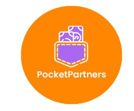

### 1.1.2. Perfiles de integrantes del equipo

<TABLE BORDER>
	<TR>
		<TH><h2>Intregantes</h2></TH> 
		<TH><h2>Descripción</h2></TH>
		<TH><h2>Conocimientos</h2></TH>
	</TR>
	<TR>
		<td style="text-align: center" align="center">
 Fiorella Jarama - U202120418   
</td> 
		<td style="text-align: center" align="center">Estudiante de 6to ciclo de la carrera de Ingeniería de Software. Me interesa la inteligencia artificial y el desarrollo de aplicaciones móviles. Me considero una persona responsable y 			autodidacta, soy buena trabajando en grupo y adquirir nuevos conocimientos de parte de mis compañeros.</td>
		<td style="text-align: center" align="center">Conocimiento de Frontend en lenguaje HTML, CSS, JavaScript. Conocimiento básico de C + +, Python, SQL. Habilidades en programas de diseño web, y conocimiento en Agile Frameworks</td>
	</TR>
    <TR>
		<td style="text-align: center" align="center">
 Nadia Lucas - [codigo]  
</td>
		<td style="text-align: center" align="center"></td>
		<td style="text-align: center" align="center"></td>
	</TR>
	<TR>
		<td style="text-align: center" align="center">
 Marco Mendez - [codigo]  
</td>
		<td style="text-align: center" align="center"></td>
		<td style="text-align: center" align="center"></td>
	</TR>
	<TR>
		<td style="text-align: center" align="center">
 Tatiana Paucar - [codigo]   
</td>
		<td style="text-align: center" align="center"></td>
		<td style="text-align: center" align="center"></td>
	</TR>
	<TR>
		<td style="text-align: center" align="center">
 Ariana Vargas - [codigo]  
</td>
		<td style="text-align: center" align="center"></td>
		<td style="text-align: center" align="center"></td>
	</TR>
	<TR>
		<td style="text-align: center" align="center">
 Néstor Velarde - [codigo]  
</td>
		<td style="text-align: center" align="center"></td>
		<td style="text-align: center" align="center"></td>
	</TR>
</TABLE>

## 1.2. Solution Profile

### 1.2.1. Antecedentes y problemática

<strong>What (Qué)</strong>

El problema radica en el desafío de dividir equitativamente los gastos y las facturas compartidas entre amigos, compañeros de cuarto, familiares y grupos, este proceso podía ser complicado y propenso a generar conflictos, ya que calcular quién debe cuánto y a quién puede resultar confuso y tedioso.

<strong>When (Cuándo)</strong>

El dilema principal surge cuando se tiene situaciones donde hay gastos compartidos que deben dividirse equitativamente entre múltiples personas. Esto puede ocurrir en cualquier momento en el que un grupo de individuos comparta gastos, ya sea en viajes, cenas, facturas de servicios públicos o cualquier otro tipo de transacción económica compartida.

<strong>Where (Dónde)</strong>

El servicio está direccionado a ser agente de solución para los grupos de personas que comparten responsabilidades económicas de una mismo recinto.

<strong>Where (Dónde)</strong>

El problema se manifiesta durante el proceso de dividir y rastrear gastos compartidos. hay una necesidad de registrar fácilmente quién pagó qué, dividir los gastos de manera equitativa y realizar un seguimiento en tiempo real de quién debe dinero a quién, esto permite simplificar y transparentar este proceso, por otro lado, ayuda a prevenir malentendidos y conflictos relacionados con el dinero, mejorando así la experiencia de compartir gastos entre amigos, familiares y compañeros de vivienda.

<strong>Who (Quién)</strong>

La plataforma será utilizada por una variedad de personas, incluidos amigos que comparten gastos en viajes, compañeros de apartamento que dividen el alquiler y las facturas, parejas que gestionan sus finanzas conjuntas, entre otros grupos que necesitan dividir y rastrear gastos compartidos.

<strong>Why (Por qué)</strong>

La causa principal del problema es tener un registro manual de quién ha pagado qué y quién debe a quién puede resultar confuso y propenso a errores humanos, lo que puede dar lugar a malentendidos y conflictos.

<strong>How (Cómo)</strong>

Permite a los usuarios registrar fácilmente quién pagó qué, dividir los gastos de manera equitativa y realizar un seguimiento en tiempo real de quién debe dinero a quién. Al simplificar y transparentar este proceso, podemos ayudar a prevenir malentendidos y conflictos relacionados con el dinero, mejorando así la experiencia de compartir gastos entre amigos, familiares y compañeros de vivienda.

<strong>How much (Cuánto)</strong>

Según La Encuesta Nacional de Capacidades Financieras (2023), el 46% de la población peruana cuenta con un nivel medio de educación financiera y un 13% tiene un nivel adecuado; pero aún hay un 41% que carece de capacidades financieras, según revela la tercera Encuesta Nacional de Capacidades Financieras, desarrollada por la Superintendencia de Banca, Seguros y AFP del Perú (SBS) y la CAF - Banco de Desarrollo de América Latina, presentada en la inauguración de la Semana Mundial del Ahorro 2023. La encuesta tiene como objetivo conocer los niveles de conocimientos, actitudes y comportamientos de los peruanos con relación a temas financieros, así como identificar cambios producidos respecto a los años 2013 y 2019. Esta fue realizada por Ipsos-Perú en el año 2022 e incluyó a peruanos a partir de los 18 años de todos los niveles socioeconómicos en zonas urbanas como rural. Cabe precisar que la encuesta se basó en la metodología de la Organización para la Cooperación y el Desarrollo Económico (OECD) y que se trata de una iniciativa que forma parte de la Política Nacional de Inclusión Financiera. Por otro lado, el porcentaje de adultos que eligió un producto financiero a partir de una comparación o búsqueda de información creció de 56% a 60% entre el 2019 y 2022. Asimismo, el consejo de familiares y amigos mantiene su influencia (40% en 2019 y 42% en el 2022) al momento de elegir un producto financiero. Sin embargo, otras estrategias que incrementan su relevancia fueron la revisión de portales de comparación de precios, tasas y tarifas y la publicidad en redes sociales, con el 21% y 18%, respectivamente. Es ahí que se ve implicado Pocket Partners como alternativa de gestión para una buena salud financiera.

<strong>How much (Cuánto)</strong>

El sistema se dirige principalmente a grupos de personas que comparten gastos, como amigos, compañeros de apartamento, parejas, etc. Por lo tanto, el porcentaje de usuarios que se verán beneficiados depende en gran medida de la prevalencia de este tipo de relaciones y situaciones de compartición de gastos en la población general. En resumen, el porcentaje de usuarios que se verán beneficiados por el servicio probablemente sea significativo, especialmente entre aquellos que comparten gastos de manera regular en diversas situaciones sociales y de convivencia. Sin embargo, el porcentaje exacto variará dependiendo de factores demográficos y culturales específicos.

### 1.2.2. Lean UX Process

#### 1.2.2.1. Lean UX Problem Statements

- Hemos detectado que a los usuarios les resulta difícil realizar un seguimiento preciso de los gastos compartidos con varias personas, lo que genera confusión, disputas y cálculos manuales que consumen mucho tiempo.
- Hemos observado que los usuarios se sienten frustrados por la falta de actualizaciones en tiempo real sobre los gastos compartidos, lo que genera incertidumbre sobre sus obligaciones financieras y posibles gastos excesivos.
- Hemos notado que los usuarios expresan frustración por el esfuerzo manual necesario para clasificar los gastos con precisión, lo que genera registros desorganizados y dificultades para rastrear los patrones de gastos.
- Hemos detectado que los usuarios desean una integración perfecta con sus cuentas bancarias u otras plataformas financieras para agilizar el seguimiento de gastos y facilitar procesos de reembolso más rápidos.
- Hemos observado que los usuarios luchan con la complejidad de liquidar facturas dentro de grupos, incluidas contribuciones desiguales, pagos parciales y múltiples métodos de pago, lo que genera retrasos y malentendidos.
- Hemos observado que los usuarios expresan preocupaciones sobre la privacidad y la seguridad cuando comparten detalles de gastos con otros, particularmente en situaciones financieras delicadas o entre conocidos.
- Hemos notado que los usuarios enfrentan desafíos al asignar responsabilidades por gastos específicos dentro de los grupos, lo que genera desacuerdos y dificultades para resolver disputas de manera justa.
- Hemos detectado que los usuarios enfrentan desafíos al asignar responsabilidades por gastos específicos dentro de los grupos, lo que genera desacuerdos y dificultades para resolver disputas de manera justa.
- Hemos detectado que los usuarios se sienten abrumados por el volumen de notificaciones y alertas dentro de la aplicación, lo que genera distracciones y dificultades para priorizar actualizaciones importantes.

#### 1.2.2.2. Lean UX Assumptions

Business Assumptions:

1. Creemos que nuestros usuarios necesitan adoptar soluciones digitales para administrar gastos compartidos.
2. Estas necesidades se pueden satisfacer con el desarrollo de una plataforma que permitirá el acceso oportuno y confiable a una plataforma en línea en lugar de métodos tradicionales como llevar un registro manual en una hoja de cálculo.
3. Nuestros clientes están dispuestos a proporcionar información financiera, como detalles de cuentas bancarias o tarjetas de crédito, para facilitar los pagos y reembolsos a través de la aplicación.
4. El valor más importante de un cliente es la equidad y la transparencia en la división de gastos compartidos y están dispuestos a utilizar una herramienta como FarFinance para lograrlo.
5. El cliente también va a obtener diversos beneficios adicionales como visualizar reportes estadísticos dentro de la aplicación con datos actuales e históricos.
6. Vamos a obtener la mayoría de los clientes ya que prefieren una experiencia de usuario sin complicaciones que les permita registrar y dividir gastos fácilmente, sin la necesidad de aprender complejas funciones o características.
7. Vamos a obtener ingresos mediante el modelo de suscripción llamado FairFinance Pro y FairFinance Enterprise con diferentes niveles para el uso de la aplicación por parte de las empresas.
8. Las notificaciones y los recordatorios automáticos son eficaces para mantener a los usuarios comprometidos y recordarles registrar sus gastos y realizar pagos en la aplicación.
9. Vamos a tener ventaja frente a nuestra competencia debido a que la plataforma incluye validación contable con las version FarFinance Enterprise.
10. El mayor riesgo del servicio es que el segmento objetivo no se muestre dispuesto e interesado en automatizar los procesos de pago colectivo. Las razones vendrían a ser de un contexto interno social: problemas de adaptación,pensamiento estático y manejo de herramientas tecnológicas.

User Assumptions:

¿Quién es el usuario?

El usuario de FarFinance puede ser cualquier persona que necesita gestionar gastos compartidos de manera eficiente, ya sea en entornos personales o profesionales:

Amigos o compañeros de cuarto: Grupos de amigos que comparten gastos comunes, como el alquiler, las facturas de servicios públicos, las compras de comestibles y las cenas fuera.

Familias: Miembros de la familia que desean realizar un seguimiento de los gastos compartidos, como la compra de comestibles, la factura del teléfono celular o los gastos de viaje.

Compañeros de trabajo: Equipos de trabajo que necesitan dividir gastos relacionados con viajes de negocios, almuerzos de equipo, suministros de oficina compartidos, etc.

Estudiantes universitarios: Estudiantes universitarios que comparten gastos de vivienda, alimentos, libros de texto y otras necesidades estudiantiles comunes.

Viajeros: Grupos de amigos o familias que viajan juntos y desean dividir los costos de alojamiento, transporte, comidas y actividades.

Grupos sociales y comunitarios: Clubes, organizaciones sin fines de lucro o equipos deportivos que necesitan rastrear y dividir los costos de eventos, salidas grupales o actividades compartidas.

Profesionales autónomos y freelancers: Trabajadores independientes que necesitan gestionar gastos comerciales compartidos, como alquiler de espacios de trabajo, herramientas y suministros.

Grupos de proyectos o equipos de estudio: Estudiantes o profesionales que trabajan en proyectos grupales o académicos y necesitan compartir gastos relacionados con materiales, reuniones, etc.

¿Qué problemas tiene nuestro producto? ¿Resolver?

Un problema que enfrenta actualmente la aplicación, radica en que para algunos usuarios, especialmente aquellos menos familiarizados con la tecnología, la interfaz podría resultar confusa o compleja de usar. Esto puede dificultar la adopción y el uso continuo de la aplicación.Por otro lado, aunque se ofrece una amplia gama de características útiles, algunos usuarios pueden encontrar que carece de ciertas funcionalidades específicas que podrían mejorar su experiencia de usuario. Por ejemplo, puede haber demanda de características adicionales de informes o integraciones con otras aplicaciones financieras. Además, dado que involucra compartir información financiera y personal con otros usuarios, la privacidad y la seguridad de los datos son preocupaciones importantes. Cualquier brecha de seguridad o preocupación relacionada con la privacidad podría afectar la confianza de los usuarios en la aplicación.

¿Qué características son importantes?

Las características más importantes de la plataforma son:
Permite dividir los gastos de manera equitativa entre amigos, compañeros de piso o familiares. Esto es especialmente útil para situaciones en las que múltiples personas comparten gastos, como el alquiler, las facturas de servicios públicos, las comidas compartidas, etc.
Registra quién debe dinero a quién, manteniendo un seguimiento claro de las deudas compartidas. Esto elimina la necesidad de llevar un registro manual y reduce las posibilidades de conflictos sobre quién debe pagar qué.
Es útil para grupos de personas que pueden utilizar diferentes monedas. La aplicación admite múltiples monedas y realiza conversiones automáticamente, lo que facilita la gestión de gastos compartidos en diferentes países o regiones.

¿Dónde encaja nuestro producto en su trabajo o vida?

El producto encaja en varios aspectos de la vida y el trabajo, especialmente en situaciones donde las personas comparten gastos y necesitan una forma conveniente y equitativa de administrar sus finanzas compartidas

¿Cuándo y cómo es nuestro producto usado?

El servicio será utilizado por el segmento objetivo cuando surja la necesidad de agregar nuevos gastos, especificar quién participa en ellos, dividir equitativamente la cantidad, agregar comentarios y notas, y realizar un seguimiento de las deudas compartidas. La aplicación también proporciona notificaciones y recordatorios para ayudar a los usuarios a mantenerse al día con sus gastos compartidos y pagos pendientes.

¿Cómo debe verse nuestro producto y cómo debe comportarse?

La apariencia y el comportamiento deseado de FarFinance deben enfocarse en la usabilidad, la claridad y la eficiencia para facilitar la gestión de gastos compartidos, la interfaz de usuario debe ser simple y clara, con un diseño intuitivo que permita a los usuarios navegar fácilmente por la aplicación y acceder a todas las funciones importantes sin confusión. Por otro lado debe verse como una aplicación limpia, organizada y con funcionalidades claras y directas que faciliten la gestión de gastos compartidos para los usuarios.

Feature Assumptions:

Creemos que la aplicación debe contar con una interfaz de usuario intuitiva y fácil de usar para gestionar sus gastos compartidos, por lo que las características se desarrollan teniendo en cuenta la simplicidad y la intuición en el diseño de la interfaz de usuario.

Creemos que la plataforma debe de tener la capacidad de manejar recordatorios para realizar pagos, por lo que las características incluyen notificaciones y recordatorios automáticos para ayudar a los usuarios a mantenerse al día con sus finanzas compartidas.

Creemos que nuestros usuarios valoran la seguridad y la privacidad de sus datos financieros, por lo que las características se diseñan para garantizar la protección de la información personal y financiera de los usuarios mediante medidas de seguridad adecuadas.

Creemos que los usuarios pueden tener diferentes preferencias y necesidades en la forma en que desean dividir sus gastos compartidos, por lo que las características proporcionan opciones flexibles para dividir los gastos de manera equitativa según las preferencias individuales.

#### 1.2.2.3. Lean UX Hypothesis Statements

Hypothesis Statement 01:
Creemos que si simplificamos el proceso de división de gastos en FairFinance los usuarios encontrarán más fácil y rápido agregar y dividir gastos compartidos. Sabremos que hemos tenido éxito cuando aumente la adopción y retención de la aplicación.

Hypothesis Statement 02:
Creemos que si implementamos notificaciones y recordatorios automáticos para deudas pendientes en FairFinance los usuarios estarán más al tanto de sus obligaciones financieras compartidas y tomarán medidas para resolverlas a tiempo. Sabremos que hemos tenido éxito cuando la gestión de gastos compartidos de nuestros usuarios se vea mejorada, así como la gestión de sus ingresos y egresos.

Hypothesis Statement 03:
Creemos que si mejoramos la sincronización de datos en FairFinance los usuarios podrán acceder y actualizar su información de gastos compartidos de manera consistente desde cualquier dispositivo. Sabremos que hemos tenido éxito cuando nuestros usuarios dejen comentarios positvos acerca del uso entre plataformas y la sincronización entre estos dispositivos.

Hypothesis Statement 04:
Creemos que si implementamos medidas de seguridad adicionales para proteger la información financiera y personal de los usuarios en FairFinance los usuarios tendrán una mayor confianza en la privacidad de sus datos y estarán más inclinados a compartir información sensible a través de la aplicación. Sabremos que hemos tenido éxito cuando veamos que más usuarios utilizan nuestros features relacionados al manejo de infromación sensible.

#### 1.2.2.4. Lean UX Canvas

El Lean UX Canvas es una herramienta utilizada en el campo del diseño centrado en el usuario (UX) y la metodología Lean para crear y desarrollar productos de manera más eficiente y efectiva. Su objetivo es proporcionar un marco estructurado para la colaboración entre equipos multidisciplinarios. A continuación se presenta el Lean UX Canvas trabajado por el equipo a través de la herramienta digital Mural:

 
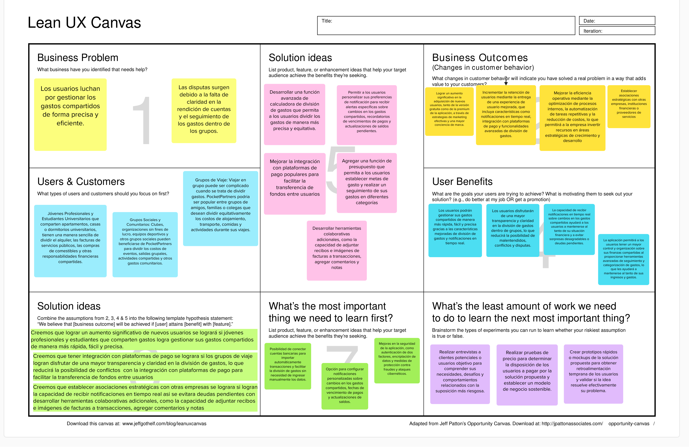

<A HREF="https://app.mural.co/t/opso6836/m/opso6836/1712598445725/0636fb07984bf6d4efa16afadcf32ed49794f9cd?sender=u3a3ac67b672d09ad13ca4525"> Lean UX Canvas PocketPartners </A>

 

<A HREF="https://app.mural.co/t/opso6836/m/opso6836/1712598445725/0636fb07984bf6d4efa16afadcf32ed49794f9cd?sender=u3a3ac67b672d09ad13ca4525"> Lean UX Canvas PocketPartners </A>

## 1.3. Segmentos objetivo

El segmento objetivo de PcketPartners consiste en personas y grupos que comparten gastos y desean una solución conveniente y efectiva para rastrear, dividir y liquidar esos gastos. Aquí hay algunos segmentos específicos que podrían formar parte del público objetivo de PocketPartners:

Grupos de Amigos o Compañeros de Piso: Personas que comparten gastos comunes, como el alquiler, las facturas de servicios públicos, las compras de comestibles y las salidas sociales.

Familias o Parejas: Hogares que desean administrar y dividir los gastos compartidos, incluyendo facturas, compras familiares y actividades recreativas.

Grupos de Viajeros: Amigos o familiares que viajan juntos y necesitan rastrear y dividir los gastos relacionados con el transporte, el alojamiento, la comida y las actividades turísticas.

Grupos de Trabajo o Proyectos: Equipos que colaboran en proyectos o actividades compartidas y necesitan una forma de dividir y registrar los gastos relacionados con el trabajo.

Estudiantes o Residentes Universitarios: Estudiantes universitarios que viven juntos o comparten gastos de manera informal, como el alquiler de alojamiento, la compra de alimentos y los gastos de ocio.

Profesionales Autónomos o Freelancers: Individuos que trabajan de forma independiente y necesitan rastrear y dividir los gastos relacionados con proyectos, clientes y actividades laborales.

Grupos de Organizaciones sin Fines de Lucro o Clubes: Organizaciones sin fines de lucro, asociaciones o clubes que necesitan una manera de administrar y dividir los gastos compartidos entre sus miembros.

PcketPartners se dirige a una amplia variedad de usuarios que comparten gastos en diferentes contextos y situaciones de la vida, ofreciendo una solución versátil y adaptable para satisfacer las necesidades de estos segmentos específicos.

# Capítulo II Requirements Elicitation & Analysis

## 2.1. Competidores

### 2.1.1. Análisis Competitivo

<table border>
    <thead>
        <tr >
            <th colspan=6 style="text-align: center">
				<h2>
					Competitive Analisis Landscape
				</h2>
			</th>
        </tr>
    </thead>
    <tbody>
        <tr>
            <td colspan=2 rowspan=2 style="text-align: center" align="center">¿Por qué llevar a cabo este análisis?</td>
            <td colspan=4 style="text-align: center" align="center">¿Quiénes son nuestros principales competidores?</td>
        </tr>
		<tr>
            <td colspan=4 style="text-align: center" align="center">Gracias al análisis de la competencia, se logra comprender el entorno competitivo en el que operará nuestro producto. Esto proporciona una visión detallada de quienes son nuestros competidores directos e indirectos, logrando así, trazar 
 una estretegia sólida para alcanzar la máxima exposición de nuestro producto, llegando así a más posibles consumidores.</td>
        </tr>
		<tr>
			<td rowspan=3 style="text-align: center" align="center">Perfil</td>
			<td rowspan=2 style="text-align: center" align="center">Overview</td>
      <td style="text-align: center" align="center">PocketPartners 

</td>
			<td style="text-align: center" align="center">Splittr 

</td>
			<td style="text-align: center" align="center">Tricount 

</td>
			<td style="text-align: center" align="center">Splitwise 

</td>
		</tr>
		<tr>
			<td style="text-align: center" align="center">Plataforma que busca facilitar el proceso de división de costos en diversas situaciones, con varias herramientas que son de utilidad en dicho momento</td>
			<td style="text-align: center" align="center">Plataforma que busca dividir los gastos grupales en viajes o comidas.</td>
			<td style="text-align: center" align="center">Plataforma colaborativa que busca dividir todo tipo de gastos grupales.</td>
			<td style="text-align: center" align="center">Plataforma que busca, de forma colaborativa, llevar un recuento de todos los gastos grupales que se hacen.</td>
		</tr>
		<tr>
			<td style="text-align: center" align="center">Ventaja Competitiva ¿Qué valor ofrecen a los clientes</td>
			<td style="text-align: center" align="center"><ul><li>Organización por grupos y etiquetas</li> <li>Notificaciones en tiempo real</li> <li>Beneficios adicionales por plan premium</li></ul> </td>
			<td style="text-align: center" align="center"><ul><li>Simplicidad de la plataforma</li> <li>Exportar a pdf o cvs</li> <li>No requiere registro</li></ul> </td>
			<td style="text-align: center" align="center"><ul><li>División desigual de gastos</li> <li>Guardado de fotos</li> <li>Notificaciones en tiempo real</li></ul> </td>
			<td style="text-align: center" align="center"><ul><li>Facilidad de uso</li> <li>Sincronización en la nube</li> <li>Métodos de pago integrados</li> <li>Funciones pro adicionales</li></ul> </td>
		</tr>
		<tr>
			<td rowspan=2 style="text-align: center" align="center">Perfil del Marketing</td>
			<td style="text-align: center" align="center">Mercado Objetivo</td>
			<td style="text-align: center" align="center"><ul><li>Viajeros que busquen dividir sus gastos</li> <li>Roomates que quieran dividir los gastos del hogar</li> <li>Grupos de personas que desean dividir los gastos de una cena</li></ul> </td>
			<td style="text-align: center" align="center"><ul><li>Viajes</li> <li>Casas compartidas</li></ul> </td>
			<td style="text-align: center" align="center"><ul><li>Parejas que desean dividir gastos</li> <li>Viajeros que quieren gestionar sus compras</li> <li>Comapñeros de piso</li></ul> </td>
			<td style="text-align: center" align="center"><ul><li>Viajeros</li> <li>Compañeros de piso</li> <li>Parejas</li> <li>Grupos de amigos</li></ul> </td>
		</tr>
		<tr>
			<td style="text-align: center" align="center">Estrategias de Marketing</td>
			<td style="text-align: center" align="center"><ul><li>Uso de publicidad en redes sociales</li> <li>Recomendación de voz a voz</li> <li>Prueba gratis de 30 días del plan premium para lograr retención</li></ul> </td>
			<td style="text-align: center" align="center"><ul><li>Promoción de la app en su cuenta de Twitter</li></ul> </td>
			<td style="text-align: center" align="center"><ul><li>Presentación de referencias en su landing page</li> <li>Cuentas activas de Facebook y Twitter</li></ul> </td>
			<td style="text-align: center" align="center"><ul><li>Presentación en una landing page vistosa</li> <li>Fácil acceso a los contactos para invitar más personas</li> <li>Página de redes sociales</li></ul> </td>
		</tr>
		<tr>
			<td rowspan=3 style="text-align: center" align="center">Perfil del Producto</td>
			<td style="text-align: center" align="center">Productos & Servicios</td>
			<td style="text-align: center" align="center">Sitio web para el registro y uso de nuestro aplicativo</td>
			<td style="text-align: center" align="center">Aplicativo móvil para el uso de la solución</td>
			<td style="text-align: center" align="center">Aplicativo móvil para el uso de la solución</td>
			<td style="text-align: center" align="center">Aplicativo móvil para el uso de la solución</td>
		</tr>
		<tr>
			<td style="text-align: center" align="center">Precios & Costos</td>
			<td style="text-align: center" align="center"><ul><li>Suscripción de un mes - 9.90 soles</li> <li>Suscripción de un año - 29.90 soles</li> <li>Suscripción empresarial - 169.90 soles</li></ul> </td>
			<td style="text-align: center" align="center"><ul><li>Pase de un mes - 2.90 soles</li> <li>Suscripción de un año - 11.90 soles</li> <li>Pase de por vida - 39.90 soles</li></ul> </td>
			<td style="text-align: center" align="center"><ul><li>Suscripción de un mes - 12.90 soles</li> <li>Suscripción de un año - 35.90 soles</li></ul> </td>
			<td style="text-align: center" align="center"><ul><li>Suscripción de un mes - 19.90 soles</li> <li>Suscripción de un año - 149.90 soles</li></ul> </td>
		</tr>
		<tr>
			<td style="text-align: center" align="center">Canales de distribución (web/móvil)</td>
			<td style="text-align: center" align="center">Plataforma web</td>
			<td style="text-align: center" align="center">Plataforma móvil</td>
			<td style="text-align: center" align="center">Plataforma móvil</td>
			<td style="text-align: center" align="center">Plataforma móvil</td>
		</tr>
		<tr>
			<td rowspan=4 style="text-align: center" align="center">Análisis SWOT</td>
			<td style="text-align: center" align="center">Fortalezas</td>
			<td style="text-align: center" align="center"><ul><li>Canales de atención disponibles</li> <li>Cálculo automático de saldos</li> <li>Uso de etiquetas para categorizar y filtrar las transacciones</li></ul> </td>
			<td style="text-align: center" align="center"><ul><li>Funciona offline</li> <li>Se sincroniza de forma automática con nuestros amigos</li></ul> </td>
			<td style="text-align: center" align="center"><ul><li>Uso de imágenes como evidencia</li> <li>Uso de claves de color para mejor visualización</li></ul> </td>
			<td style="text-align: center" align="center"><ul><li>Integración con cuentas de banco para realizar los pagos dentro de la misma aplicación</li> <li>División en partes iguales o desiguales</li></ul> </td>
		</tr>
		<tr>
			<td style="text-align: center" align="center">Debilidades</td>
			<td style="text-align: center" align="center"><ul><li>Requiere de conección a internet</li> <li>No soporta muchos idiomas</li></ul> </td>
			<td style="text-align: center" align="center"><ul><li>El diseño es demasiado simple</li> <li>Carece de diferenciadores con la competencia</li> <li>Cobra por features que se encuentran gratis en otras aplicaciones</li></ul> </td>
			<td style="text-align: center" align="center"><ul><li>La interfaz no es fácil de usar</li> <li>Cobra por features que se encuentran gratis en otras aplicaciones</li></ul> </td>
			<td style="text-align: center" align="center"><ul><li>Te da una cantidad de gastos limitados en el plan gratuito</li> <li>Los planes premium son demasiado costosos</li></ul> </td>
		</tr>
		<tr>
			<td style="text-align: center" align="center">Oportunidades</td>
			<td style="text-align: center" align="center"><ul><li>Es posible agregar más funcionalidades</li> <li>Ya se está empezando a crear un mercado gracias a las otras apps</li></ul> </td>
			<td style="text-align: center" align="center">Se puede agregar un poco más de profundidad al diseño</td>
			<td style="text-align: center" align="center">Se puede mejorar la interfaz para que sea más intuitiva</td>
			<td style="text-align: center" align="center">Es la aplicación con más features</td>
		</tr>
		<tr>
			<td style="text-align: center" align="center">Amenazas</td>
			<td style="text-align: center" align="center">Es comlpicado competir con aplicaciones ya establecidas en el mercado</td>
			<td style="text-align: center" align="center">Sigue quedándose atrás en la cantidad de features que tiene comparado con la competencia</td>
			<td style="text-align: center" align="center">Los consumidores están acostumbrados a aplicaciones intuitivas, por lo que aprender a utilizar una app va a ser complicaco para algunos usuarios</td>
			<td style="text-align: center" align="center">Los precios altos ocasionan que los usuarios no deseen pagar la suscripción</td>
		</tr>
    </tbody>
</table>

### 2.1.2. Estrategias y tácticas frente a competidores

Gracias al análisis presentado anteriormente, logramos identificar todos los aspectos necesarios para poder idear un plan de acción de forma efectiva. Con el cuál lograremos un mejor producto con mejores resultados después del periodo de lanzamiento. Acontinuación se brindará dicho plan, representado en una serie de estrategias y tácticas para alcanzar lo anteriormente mencionado.

**Afrontando las fortalezas de nuestros competidores:**

- Se sincroniza de forma automática con nuestros amigos
- Uso de imágenes como evidencia
- Uso de claves de color para mejor visualización
- Integración con cuentas de banco para realizar los pagos dentro de la misma aplicación

**Comprendemos que nuestras fortalezas son:**

- Canales de atención disponibles
- Cálculo automático de saldos
- Uso de etiquetas para categorizar y filtrar las transacciones

Entonces, podemos aplicar las siguientes estrategias y tácticas:

**Estrategias**

- Hacer que el usuario se sienta cómodo utilizando nuestra aplicación.

**Tácticas**

- Aplicar códigos de color para que sea más amigable visualmente para los consumidores
- Agregar la opción de agregar imágenes
- Añadir la sincronización en tiempo real

**Afrontando las debilidades de nuestros competidores:**

- El diseño es demasiado simple
- Cobra por features que se encuentran gratis en otras aplicaciones
- La interfaz no es fácil de usar
- Los planes premium son demasiado costosos

**Comprendemos que nuestras debilidades son:**

- Requiere de conección a internet
- No soporta muchos idiomas

Entonces, podemos aplicar las siguientes estrategias y tácticas:

**Estrategias**

- Crear un ambiente intuitivo y visual para que el usuario no se sienta perdido al momento de utilizar el aplicativo, además de brindarle el mejor valor por su dinero

**Tácticas**

- Utilizar un diseño llamativo
- Crear una interfaz dinámica e intuitiva
- No elevar demasiado los costos luego del posicionamiento inicial
- Agregar más features gratis

**Afrontando las oportunidades de nuestros competidores:**

- Se puede agregar un poco más de profundidad al diseño
- Se puede mejorar la interfaz para que sea más intuitiva
- Es la aplicación con más features

**Comprendemos que oportunidades fortalezas son:**

- Es posible agregar más funcionalidades
- Ya se está empezando a crear un mercado gracias a las otras apps

Entonces, podemos aplicar las siguientes estrategias y tácticas:

**Estrategias**

- Aprovecharemos las oportunidades de nuestros competidores para agregar sus mejoras a nuestro aplicativo

**Tácticas**

- Añadir las mejoras de nuestros competidores
- Aprovechar el mercado existente para tener más alcance

**Afrontando las amenazas de nuestros competidores:**

- Sigue quedándose atrás en la cantidad de features que tiene comparado con la competencia
- Los consumidores están acostumbrados a aplicaciones intuitivas, por lo que aprender a utilizar una app va a ser complicaco para algunos usuarios
- Los precios altos ocasionan que los usuarios no deseen pagar la suscripción

**Comprendemos que nuestras amenazas son:**

- Es comlpicado competir con aplicaciones ya establecidas en el mercado

Entonces, podemos aplicar las siguientes estrategias y tácticas:

**Estrategias**

- Utilizaremos las amenazas de los otros competidores para evitar caer en los mismos errores que ellos

**Tácticas**

- No aumentar mucho los precios
- Siempre comparar nuestros features con los de la competencia para no quedarnos por detrás
- Crear una interfaz intuitiva y simple

## 2.2. Entrevistas

### 2.2.1. Diseño de entrevistas

_Preguntas generales:_

- ¿Cuál es su nombre?
- ¿Cuántos años tiene?
- ¿Cuál es la actividad que más realiza con sus amigos o conocidos?

## Preguntas para viajeros

1. Al momento de realizar su viaje, ¿cómo llevan los registros de los gastos de cada uno?
2. Cuando viaja con sus amigos, ¿cómo suelen realizar los pagos?
3. ¿Cuál piensa que es la mayor dificultad al momento de hacer esta operación?
4. ¿Encuentra tardado este proceso de divisón?
5. ¿Qué hace cuando se olvida anotar algún gasto o préstamo realizado?
6. ¿Conoce alguna herrmienta que le pueda ayudar a realizar estos cálculos?

## Preguntas para amigos que salen a almorzar

1. Cuando salen a cenar, ¿cómo pagan la cuenta?
2. ¿Cómo hacen para recordar cuánto debe pagar cada uno?
3. ¿Cuánto tiempo se demoran en el proceso del cálculo?
4. ¿Qué hace cuando se olvida anotar algún gasto o préstamo realizado?
5. ¿Conoce alguna herrmienta que le pueda ayudar a realizar estos cálculos?
6. ¿Cuál piensa que es la mayor dificultad al momento de hacer esta operación?

## Preguntas para compañeros de piso

1. ¿Cuál es su proceso para dividir los gastos?
2. ¿Cómo lleva registro de los gastos?
3. ¿Cómo lleva registro de los pagos?
4. ¿Conoce alguna manera de hacer más simple este tema?
5. ¿Cuál es la mayor dificultad que tiene al momento de realizar esta operación?
6. ¿Conoce alguna herramienta que le pueda ayudar a realizar estos cálculos?

### 2.2.2 Registro de entrevistas
Link de las entrevistas:
<a href="https://upcedupe-my.sharepoint.com/:v:/g/personal/u20221a715_upc_edu_pe/Eauqe08D_odKv6wei15YkBgBGgLwmBNKkY-dZDeTV66P1g?e=moang1
">Entrevistas</a></td>

#### Renzo Castro, 20 años.

 

  
 

Inicio: Minuto 14:50
Fin: Minuto 20:10

##### Resumen de la entrevista

El entrevistado indica que al momento de viajar o en salidas con amigos y a la vez con personas con las que vive, utiliza herramientas conocidas como papel y lápiz, Google Sheets o Excel para llevar el registro de los gastos. Indica que el proceso de división de gastos es demora y que en ocasiones se olvida de anotar algún gasto o préstamo. Además, menciona que no conoce muchas herramientas que le ayuden con los cálculos o que le faciliten el proceso aparte de Splitwise o otra mas conocida.
 

#### Salvador Chamorro, 22 años.

  

Inicio: Minuto 04:09
Fin: Minuto 8:16

##### Resumen de la entrevista

El entrevistado indica que al momento de viajar o en salidas con amigos y a la vez con personas con las que vive, utiliza herramientas conocidas como papel y lápiz, Google Sheets o Excel para llevar el registro de los gastos. Indica que el proceso de división de gastos es demora y que en ocasiones es dificil cuado hay muchas personas involucradas. Además, menciona que no conoce muchas herramientas que le ayuden con los cálculos o que le faciliten este proceso.
 

#### Margarita Robles, 36 años.

 

  
 

Inicio: Minuto 00:00
Fin: Minuto 04:04

##### Resumen de la entrevista

La entrevistada indica ser una viajera concurrente con sus amigos o grupos afines de la misma actividad, utiliza herramientas caseras de apuntes como un cuadernillo, notas en el celular al momento de hacer registros y una calculadora al hacer los cálculos finales. Indica que el proceso de división de todos los gastos le toma buen tiempo de demora y que en ocasiones se da cuenta que olvidó anotar algún gasto o préstamo, lo cual es molesto. Menciona que no conoce ninguna herramienta que le ayude con los cálculos o que le faciliten el proceso de registras los gastos compartidos con sus compañeros viajeros, así que está contenta y dispuesta de recibir mayores noticias de nuestro producto PocketPartners.

#### Pilar Iturbe, 32 años.

 

  
 

 
 Inicio: Minuto 22:11
Fin: Minuto 23:49

##### Resumen de la entrevista

Pilar tiene 32 años las acrividades que ams realiza con sus amios es salir a comer,
en cuanto a sus compañeros de piso, divide los gastos y pagos siempre por whatsapp
no ha tenido muchas dificultades con este proceso y no conoce aluna herramienta
que pueda ayudarle con este proceso
. 

#### Ana Lucia Aguilar, 33 años.

 

  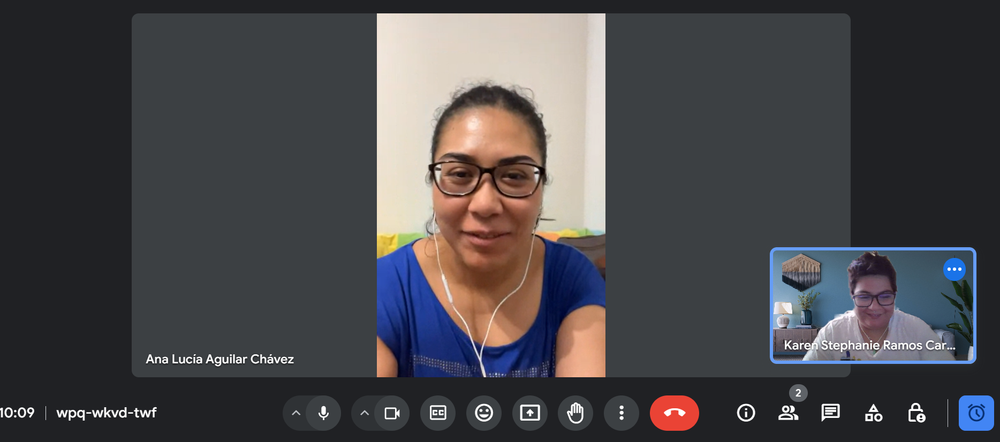
 

 
  Inicio: Minuto 23:49
  Fin: Minuto 26:36

##### Resumen de la entrevista

Ana Lucia tiene 33 años y la actividad u ma realia con sus amigos y conocidos es viajar,
al momemnto de realizar u viaje le toman foto a los pagos o las boletas que tengan
y cada uno realiza el pago respectivo a quien realizo el pago, no encuentra mucha demora
al realizar los pagos ya que tienen un acuerdo previo de pago, lo que utilizza es la calculadora
para realizar los calculos no conoce alguna aplicaacion que le ayude con este tipo de calculos. 

#### Elizabeth Saico Quispe, 32 años.

 

  
 

Inicio: Minuto 26:37
Fin: Minuto 29:46

##### Resumen de la entrevista

La entrevistada indica que es muy importante llevar el gasto, ya que algunas ocasionaes uno paga ya sea con yape o tranferencia y los demas le hacen en recargo, pero muchas veces es tedioso llevar un control en imagenes de dichos pagos la mayoria de veces solo se usa whatsapp sobre todo cuandos se tiene un viaje programado, por ahora el unico registro que lleva es el del historial de imagenes de whatsapp y el registrr de movimiento de sus tarjetas. Con el pasar de los dias de la finalizacion de algun viaje eso termina olvidandose y nunca se saldan cuentas. 

#### Nadia Lucas Coronel, 22 años.

 

  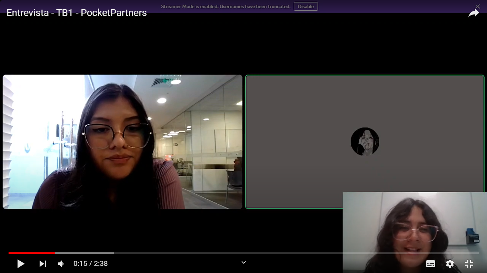
 

 
  Inicio: Minuto 08:17
  Fin: Minuto 10:54

##### Resumen de la Entrevista

La entrevista proporciona una visión clara sobre cómo las personas gestionan y dividen sus gastos compartidos, destacando la importancia de establecer acuerdos iniciales y llevar un registro detallado de los gastos y pagos. Nadia menciona la variedad de métodos utilizados, desde guardar recibos físicos hasta el uso de aplicaciones móviles específicas. Aunque se resalta la necesidad de simplificar el proceso, se señala una dificultad común en recordar quién pagó qué, lo que destaca la demanda de herramientas más eficientes para facilitar la división de gastos

#### Isaac Martín Nonalaya Rondón, 21 años.

 

  
 

 
  Inicio: Minuto 10:55
  Fin: Minuto 14:52

##### Resumen de la Entrevista

La entrevista proporciona una visión clara sobre cómo algunas personas siguen llevando un método tradicional para llevar el registro de sus gastos debido a la complejidad que supone aprender otros métodos. Pero esto también refleja el interes de las personas por tener sus cuentas claras en todo momento, así como evidencia el uso de un sistema de registros de sus ingresos y egresos.

### 2.2.3. Análisis de entrevistas

Los entrevistados destacan la necesidad de simplificar y agilizar el proceso de dividir gastos durante viajes y salidas con amigos o compañeros de vivienda. En ambas situaciones, los entrevistados utilizan métodos tradicionales como papel y lápiz, Google Sheets o Excel para llevar un registro de los gastos compartidos, pero enfrentan desafíos como la demora en el proceso, olvidos de gastos o préstamos, y la falta de conocimiento sobre herramientas más eficientes. Sin embargo, muestran disposición para adoptar soluciones que faciliten esta tarea. En este contexto, PocketPartners emerge como una solución prometedora. Al ofrecer una interfaz intuitiva, cálculos automáticos y registro en tiempo real, esta aplicación tiene el potencial de simplificar drásticamente el proceso de división de gastos, ayudando a los usuarios a gestionar de manera más efectiva sus finanzas compartidas durante sus actividades sociales y de viaje.

## 2.3. Needfinding

### 2.3.1 User Personas

## **User persona viajero**

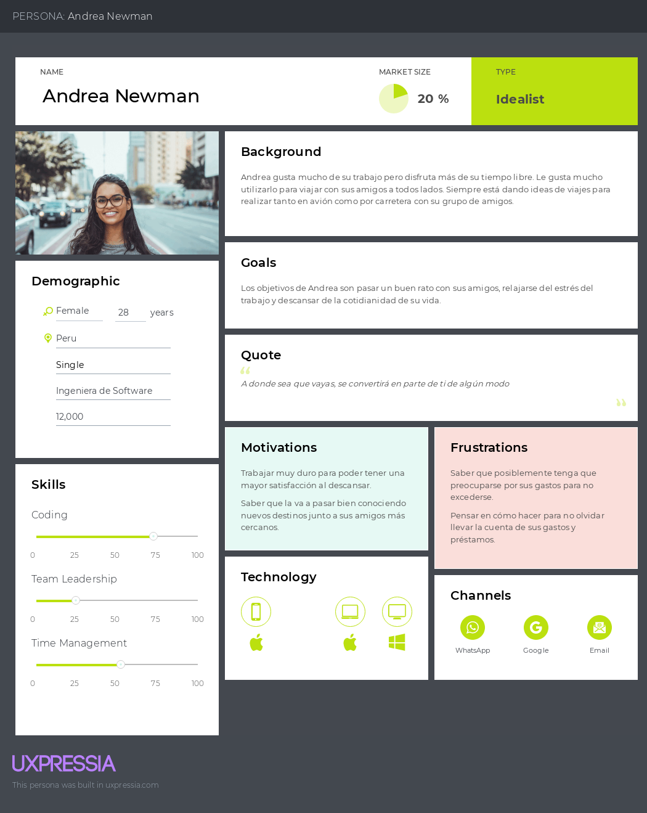

## **User persona que frecuenta restaurantes**

## **User persona compañero de piso**

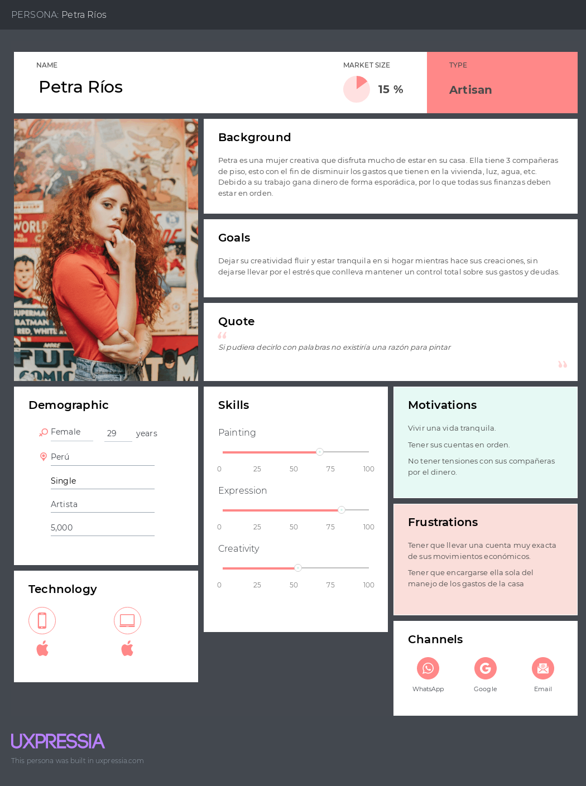

### 2.3.2 User task Matrix

<table >
    <thead>
        <tr>
        	<th colspan=1 style="text-align: center"></th>
		<th colspan=2 style="text-align: center">Viajero</th>
		<th colspan=2 style="text-align: center">Frecuenta restaurantes</th>
		<th colspan=2 style="text-align: center">Tiene compañeros de piso</th>
        </tr>
    </thead>
    <tbody>
        <tr>
        	<td style="text-align: center" align="center">TASK</td>
        	<td style="text-align: center" align="center">FREQUENCY</td>
		<td style="text-align: center" align="center">IMPORTANCE</td>
		<td style="text-align: center" align="center">FREQUENCY</td>
		<td style="text-align: center" align="center">IMPORTANCE</td>
		<td style="text-align: center" align="center">FREQUENCY</td>
		<td style="text-align: center" align="center">IMPORTANCE</td>
        </tr>
	<tr>
        	<td style="text-align: center" align="center">Dividir los gastos</td>
        	<td style="text-align: center" align="center">Always</td>
		<td style="text-align: center" align="center">High</td>
		<td style="text-align: center" align="center">Always</td>
		<td style="text-align: center" align="center">High</td>
		<td style="text-align: center" align="center">Always</td>
		<td style="text-align: center" align="center">High</td>
        </tr>
	<tr>
        	<td style="text-align: center" align="center">Calcular los gastos</td>
        	<td style="text-align: center" align="center">Sometimes</td>
		<td style="text-align: center" align="center">Medium</td>
		<td style="text-align: center" align="center">Always</td>
		<td style="text-align: center" align="center">HIgh</td>
		<td style="text-align: center" align="center">Always</td>
		<td style="text-align: center" align="center">High</td>
        </tr>
	<tr>
        	<td style="text-align: center" align="center">Mantener registro de deudas</td>
        	<td style="text-align: center" align="center">Always</td>
		<td style="text-align: center" align="center">High</td>
		<td style="text-align: center" align="center">Sometimes</td>
		<td style="text-align: center" align="center">High</td>
		<td style="text-align: center" align="center">Always</td>
		<td style="text-align: center" align="center">High</td>
        </tr>
	<tr>
        	<td style="text-align: center" align="center">Mantener registro de pagos</td>
        	<td style="text-align: center" align="center">Always</td>
		<td style="text-align: center" align="center">High</td>
		<td style="text-align: center" align="center">Always</td>
		<td style="text-align: center" align="center">Medium</td>
		<td style="text-align: center" align="center">Always</td>
		<td style="text-align: center" align="center">High</td>
        </tr>
	<tr>
        	<td style="text-align: center" align="center">Rotular los gastos</td>
        	<td style="text-align: center" align="center">Sometimes</td>
		<td style="text-align: center" align="center">Medium</td>
		<td style="text-align: center" align="center">Never</td>
		<td style="text-align: center" align="center">Low</td>
		<td style="text-align: center" align="center">Sometimes</td>
		<td style="text-align: center" align="center">Low</td>
        </tr>
	<tr>
        	<td style="text-align: center" align="center">Uso de múltiples divisas</td>
        	<td style="text-align: center" align="center">Sometimes</td>
		<td style="text-align: center" align="center">High</td>
		<td style="text-align: center" align="center">Never</td>
		<td style="text-align: center" align="center">Low</td>
		<td style="text-align: center" align="center">Sometimes</td>
		<td style="text-align: center" align="center">Medium</td>
        </tr>
	<tr>
        	<td style="text-align: center" align="center">Guardado de boletas</td>
        	<td style="text-align: center" align="center">Always</td>
		<td style="text-align: center" align="center">Medium</td>
		<td style="text-align: center" align="center">Sometimes</td>
		<td style="text-align: center" align="center">Low</td>
		<td style="text-align: center" align="center">Always</td>
		<td style="text-align: center" align="center">High</td>
        </tr>
	<tr>
        	<td style="text-align: center" align="center">Uso de archivos excel</td>
        	<td style="text-align: center" align="center">Always</td>
		<td style="text-align: center" align="center">High</td>
		<td style="text-align: center" align="center">Sometimes</td>
		<td style="text-align: center" align="center">Medium</td>
		<td style="text-align: center" align="center">Neves</td>
		<td style="text-align: center" align="center">Low</td>
        </tr>
	<tr>
        	<td style="text-align: center" align="center">Estar notificados de los consumos de otros</td>
        	<td style="text-align: center" align="center">Always</td>
		<td style="text-align: center" align="center">Medium</td>
		<td style="text-align: center" align="center">Sometimes</td>
		<td style="text-align: center" align="center">Low</td>
		<td style="text-align: center" align="center">Sometimes</td>
		<td style="text-align: center" align="center">Medium</td>
        </tr>
    </tbody>
</table>

### 2.3.3 User Journey Mapping

## **User persona viajero**

## **User persona que frecuenta restaurantes**

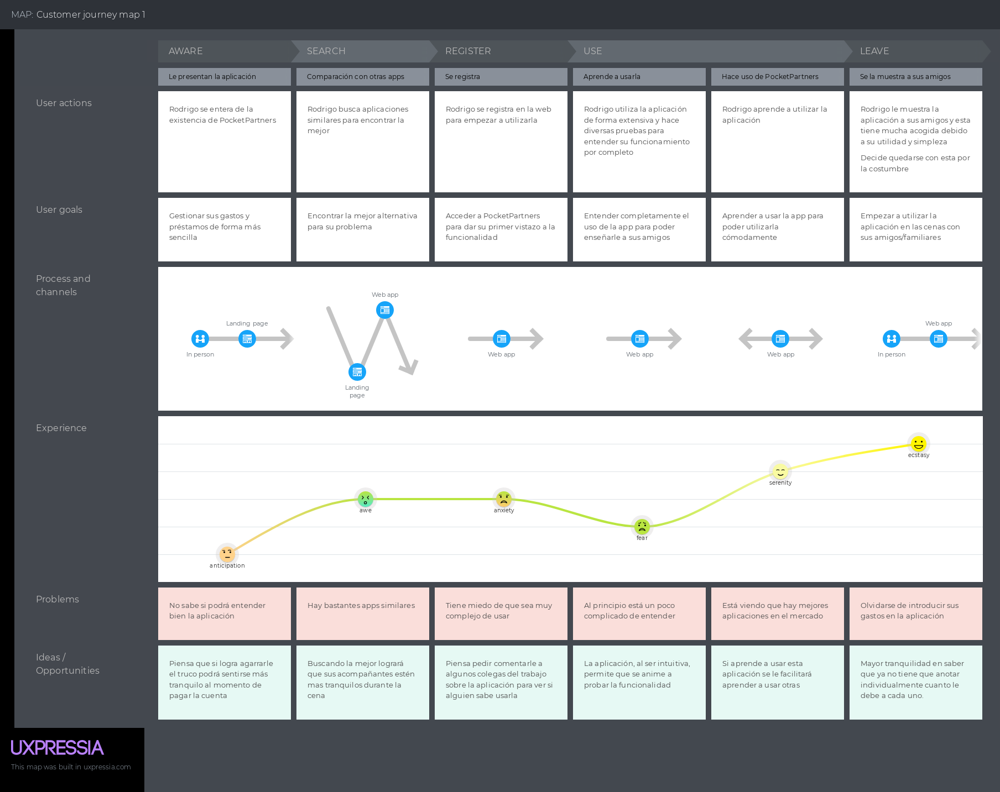

## **User persona compañero de piso**

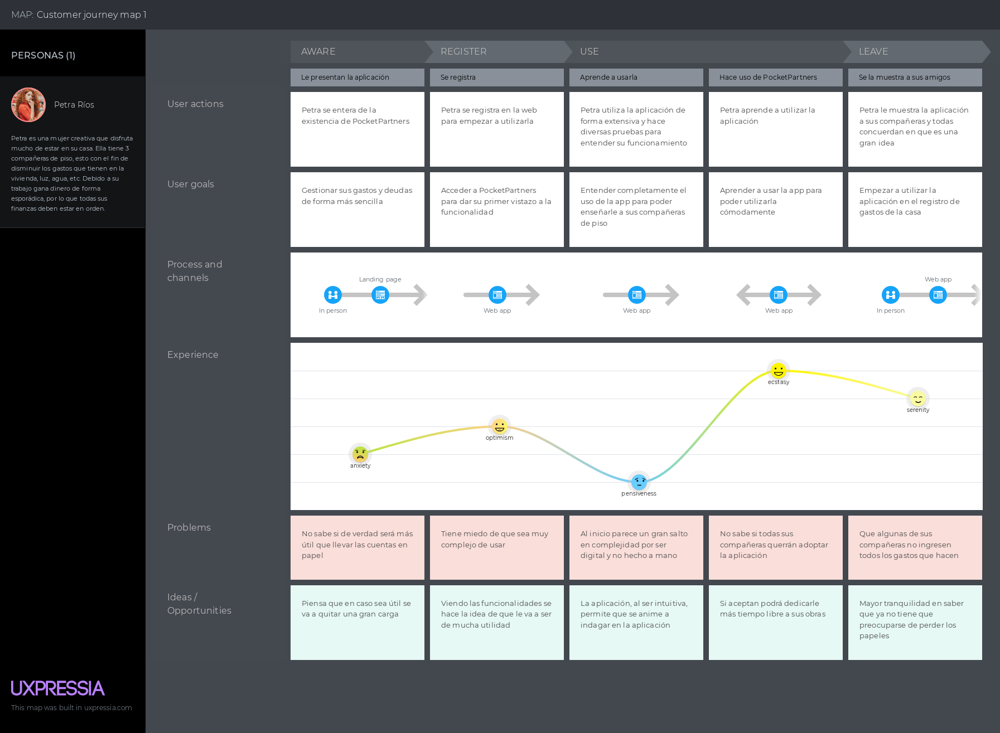

### 2.3.4 Empathy Mapping

Técnica utilizada en el diseño UX y la investigación de usuarios para comprender mejor las necesidades, emociones y comportamientos de los usuarios. Mapa Visual que representa desde la perspectiva del usuario el recorrido de sus necesidades y deseos en la problemática reconocida.

## **Empathy Map User Viajero**

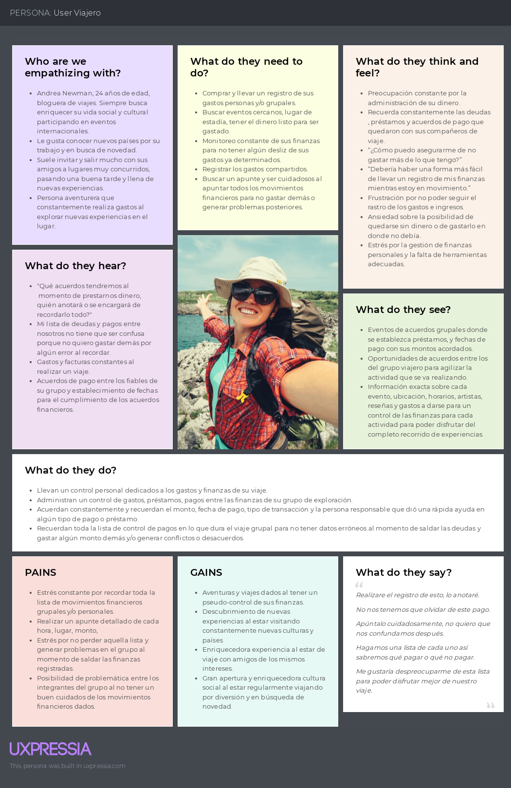

## **Empathy Map User Frecuente de restaurantes**

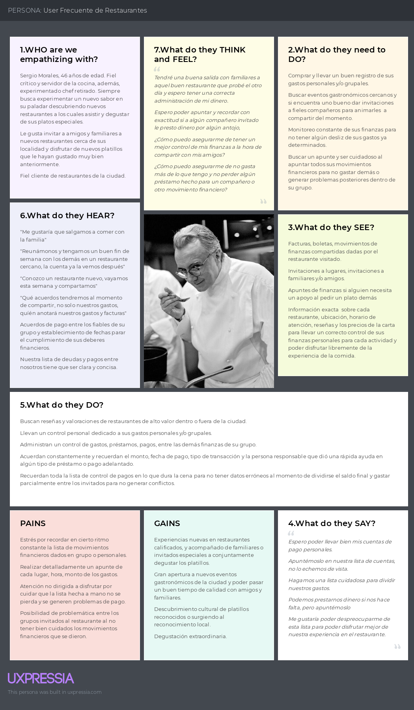

## **Empathy Map User Compañero de Piso**

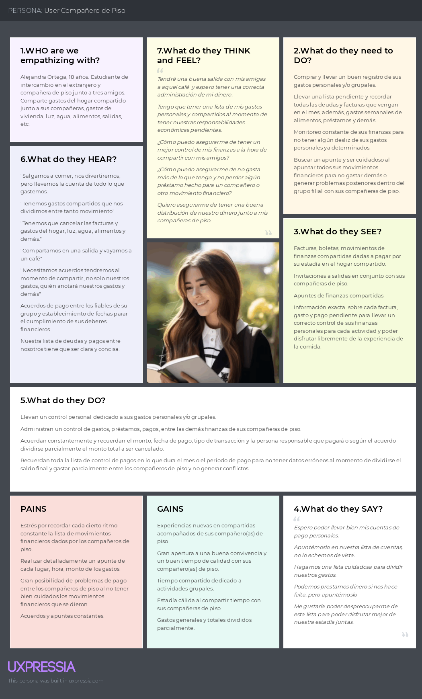

### 2.3.5 As-Is Scenario Mapping

Visualización y comprensión el estado actual del proceso de la determinación de requerimientos. Este mapa muestra el flujo de actividades, las interacciones entre elementos y las áreas potenciales para mejorar.

### As - Is User Viajero

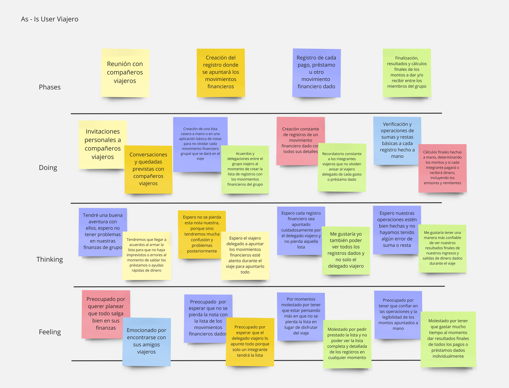

### As - Is User Frecuente de Restaurante

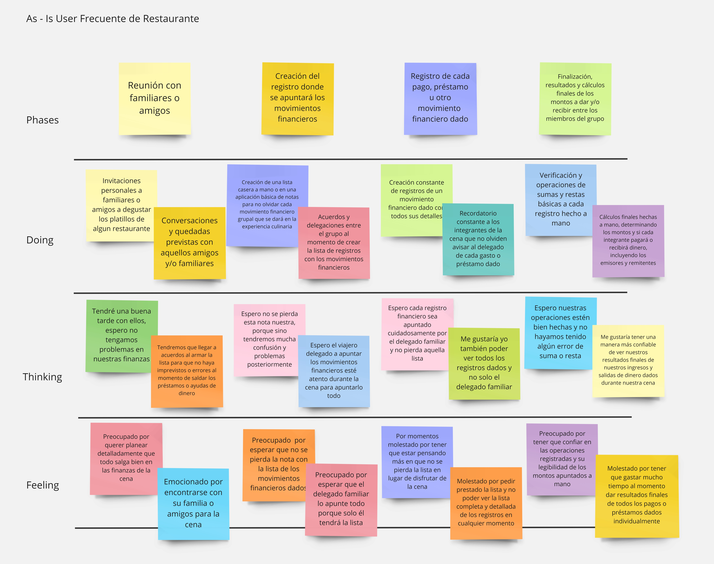

### As - Is User Compañero de Piso

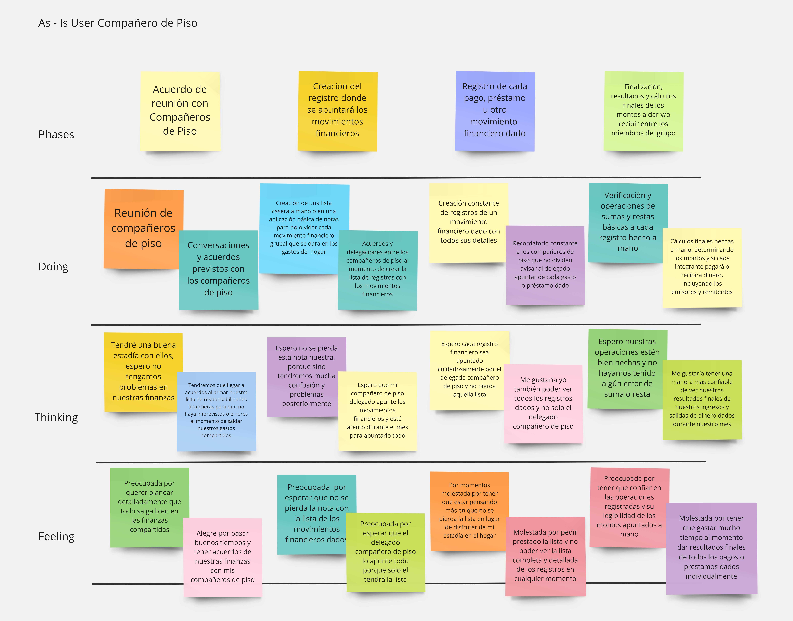

## 2.4 Ubiquitous Language

- Final User(Usuario Final): Usuario determinado como miembro del grupo SplitWise, quien podrá crear registros, obtener los cálculos finales, etc.
- Expense(Gasto): Los gastos los registra el usuario y se pueden clasificar como alimentos, servicios públicos, etc.
- Record(Registro): Los registros se dar por el usuario y se podrán ordenar y filtrar para facilitar el acceso.
- Balance(Balance): Registros de todos los movimientos financieros detodos los montos ingresados de los registros dados por el usuario.
- Final Total Calculation(Cálculos finales): La plataforma calcula el importe total final de cada usuario en función de sus aportaciones y gastos.
- Notification(Notificación): Los usuarios reciben notificaciones de nuevos gastos y actualizaciones de saldo.
- Settlement(Asentamiento): La aplicación ofrece opciones para métodos de pago y seguimiento de transacciones.
- Expense Sharing(Gasto compartido): La aplicación calcula automáticamente el valor equitativo.
- Summary(Resumen): La plataforma proporciona un resumen de las transacciones y saldos de cada usuario.
- Dashboard(Dashboard): El panel muestra una descripción general de las finanzas del grupo, incluidos saldos y transacciones recientes.
- Privacy Settings(Configuraciones de privacidad): Los usuarios pueden establecer preferencias de privacidad para su información financiera.
- Reminder(Recordatorio): La plataforma envía recordatorios a los usuarios sobre registros de transacciones o liquidaciones pendientes.
- Integration(Integración): La plataforma ofrece integración con servicios externos para procesamiento de pagos e importación/exportación de datos.

# Capítulo III Requirements Especification

## 3.1 To-Be Scenario Mapping

### To - Be User Viajero

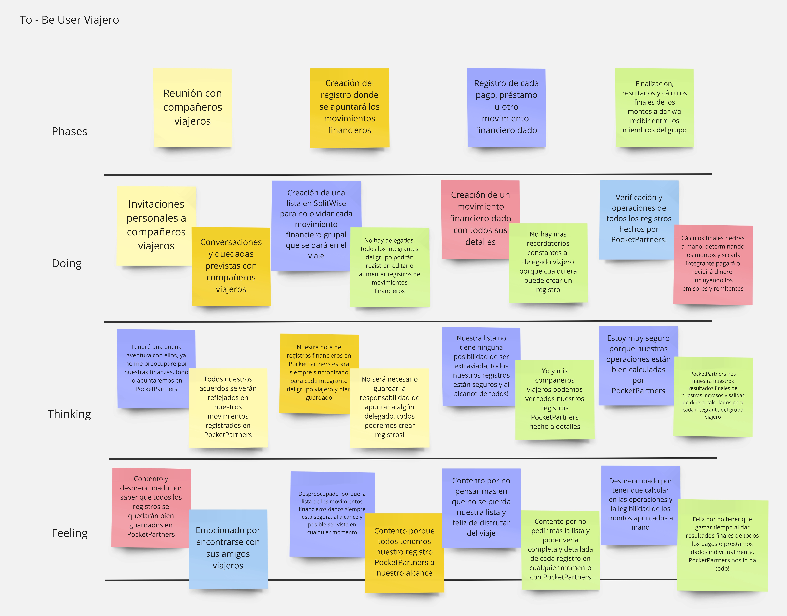

### To - Be User Frecuente de Restaurante

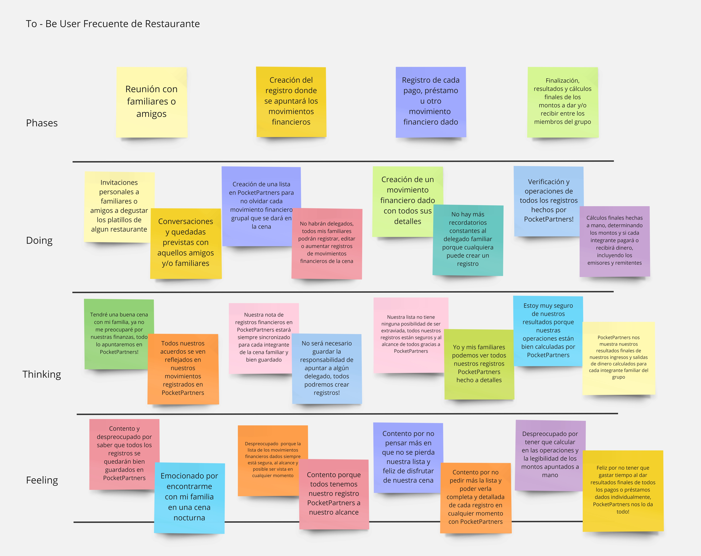

### To - Be User Compañero de Piso

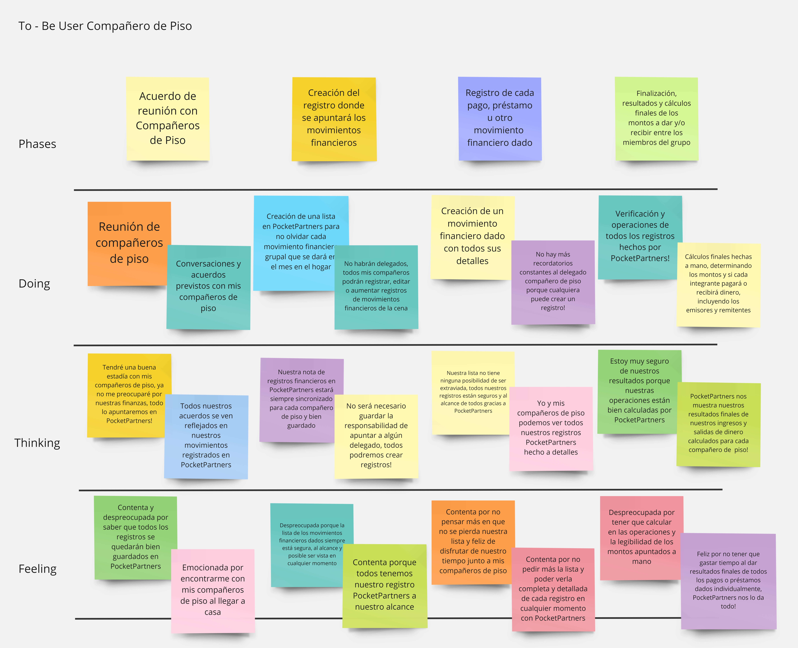

## 3.2 User Stories

<table style="border-collapse: collapse; border: 1px solid black;">
    <thead>
      <tr>
        <th style="border: 1px solid black;"><h2>User Story ID</h2></th>
        <th style="border: 1px solid black;"><h2>Titulo</h2></th>
        <th style="border: 1px solid black;"><h2>Descripción</h2></th>
        <th style="border: 1px solid black;"><h2>Criterios de aceptación</h2></th>
        <th style="border: 1px solid black;"><h2>Relacionado con (Epic ID)</h2></th>
      </tr>
    </thead>
    <tbody>
    <!-- US-01 -->
        <tr>
        <td style="text-align: center; border: 1px solid black;" align="center"><b>US-01</b></td>
        <td style="text-align: center; border: 1px solid black;" align="center">Landing Page - Home</td>
        <td style="border: 1px solid black;" align="justify">
          Como usuario, quiero encontrar una página de inicio atractiva y bien diseñada al ingresar al sitio web de la empresa, para obtener una impresión positiva de la misma desde el primer momento.
        </td>
        <td style="border: 1px solid black;" align="justify">
          <b>Escenario 1: Seccion Home</b>  
          <b>Dado que:</b> un usuario habitual de la aplicación PocketPartners desea poder observar de que va 
            <b>Cuando:</b> ingresa a la sección "Home" desde el Landing Page 
            <b>Entonces:</b> se muestra una imagen resumen y un Hero atractivo, ademas de una barra de navegación.
             
        </td>
        <td style="text-align: center; border: 1px solid black;" align="center">EP01</td>
      </tr>
    <!-- US-02 -->
    <tr>
        <td style="text-align: center; border: 1px solid black;" align="center"><b>US-02</b></td>
        <td style="text-align: center; border: 1px solid black;" align="center">Seccion - Servicios</td>
        <td style="border: 1px solid black;" align="justify">
          Como usuario, quiero observar una seccion en el Landing Page que me diga que servicios ofrece este aplicativo.
        </td>
        <td style="border: 1px solid black;" align="justify">
          <b>Escenario:</b> Descubriendo los Servicios en el Landing Page  
            <b>Dado que</b> un potencial usuario interesado en las funcionalidades del aplicativo PocketPartners.  
            <b>Cuando</b> ingresa al Landing Page de la aplicación.  
            <b>Entonces</b> desea encontrar una sección claramente identificada que informe sobre los servicios que ofrece la aplicación.  
            <b>Y</b>, encuentra una descripción concisa y atractiva de las características y beneficios principales que ofrece la aplicación.  
            <b>Y</b>, esta sección proporciona una visión general de cómo el aplicativo ayudaria en la gestión de las finanzas y en la colaboración con otros usuarios.
        </td>
        <td style="text-align: center; border: 1px solid black;" align="center">EP01</td>
      </tr>
    <!-- US-03 -->
    <tr>
        <td style="text-align: center; border: 1px solid black;" align="center"><b>US-03</b></td>
        <td style="text-align: center; border: 1px solid black;" align="center">Video - AboutTheProduct</td>
        <td style="border: 1px solid black;" align="justify">
          Como usuario, quiero observar una seccion en el Landing Page que tenga un video acerca del producto que estoy considerando usar.
        </td>
        <td style="border: 1px solid black;" align="justify">
          <b>Escenario:</b> Visualizando el Video sobre el Producto en el Landing Page  
            <b>Dado que</b> un usuario esta interesado en conocer más sobre el producto PocketPartners.  
            <b>Cuando</b> accede al Landing Page de la aplicación.  
            <b>Entonces</b> encuentra una sección dedicada que contenga un video explicativo sobre el producto.  
            <b>Y</b>, observa que este video proporciona información relevante y atractiva sobre las características clave, el funcionamiento y los beneficios de utilizar PocketPartners.  
            <b>Y</b>, se da cuenta que el video esta bien presentado y sea fácil de reproducir, lo cual permitirá obtener una comprensión clara y rápida de lo que ofrece el producto.
        </td>
        <td style="text-align: center; border: 1px solid black;" align="center">EP01</td>
      </tr>
    <!-- US-04 -->
    <tr>
        <td style="text-align: center; border: 1px solid black;" align="center"><b>US-04</b></td>
        <td style="text-align: center; border: 1px solid black;" align="center">Seccion Reseñas</td>
        <td style="border: 1px solid black;" align="justify">
          Como usuario, quiero observar una seccion donde halla reseñas de aquellos usuarios que ya hicieron uso de la aplicacion.
        </td>
        <td style="border: 1px solid black;" align="justify">
          <b>Escenario:</b> Leyendo Reseñas en la Sección de Reseñas del Landing Page  
            <b>Dado que</b> un usuario interesado en la aplicación PocketPartners y quiere tener una idea de las experiencias de otros usuarios.  
            <b>Cuando</b> visita la sección de "Reseñas" en el Landing Page.  
            <b>Entonces</b> encuentra testimonios y opiniones de usuarios que ya han utilizado la aplicación.  
            <b>Y</b>, observa que estas reseñas sean variadas, incluyendo opiniones positivas y constructivas, para tener una visión equilibrada del producto.  
        </td>
        <td style="text-align: center; border: 1px solid black;" align="center">EP01</td>
      </tr>
    <!-- US-05 -->
    <tr>
        <td style="text-align: center; border: 1px solid black;" align="center"><b>US-05</b></td>
        <td style="text-align: center; border: 1px solid black;" align="center">Seccion Registro</td>
        <td style="border: 1px solid black;" align="justify">
          Como usuario, quiero observar una seccion donde halla un apoyo visual y un formulario para registarse.
        </td>
        <td style="border: 1px solid black;" align="justify">
           <b>Escenario:</b> Registrándose en la Sección de Registro del Landing Page 
            <b>Dado que</b> es un usuario nuevo interesado en utilizar la aplicación PocketPartners. 
            <b>Cuando</b> visita la sección de "Registro" en el Landing Page. 
            <b>Entonces</b> espera encontrar un formulario claro y sencillo que le permita crear una cuenta nueva. 
            <b>Y,</b> desea que la sección incluya elementos visuales que le guíen durante el proceso de registro, como iconos intuitivos o ejemplos de información a proporcionar.  
            <b>Y</b>, busca un proceso de registro rápido y sin complicaciones, con la opción de recibir confirmación de registro por correo electrónico para garantizar la seguridad de su cuenta.
        </td>
        <td style="text-align: center; border: 1px solid black;" align="center">EP01</td>
      </tr>
    <!-- US-06 -->
    <tr>
        <td style="text-align: center; border: 1px solid black;" align="center"><b>US-06</b></td>
        <td style="text-align: center; border: 1px solid black;" align="center">Seccion Contacto</td>
        <td style="border: 1px solid black;" align="justify">
          Como usuario, quiero observar una seccion donde este los contactos, como numero fijo o redes sociales, de la empresa. 
        </td>
        <td style="border: 1px solid black;" align="justify">
          <b>Escenario:</b> Consultando los Contactos de la Sección "Footer" del Landing Page  
            <b>Dado que</b> es un usuario interesado en obtener más información sobre la empresa detrás de la aplicación PocketPartners. 
            <b>Cuando</b> llega al final del Landing Page y observa la sección "Footer". 
            <b>Entonces</b> espera encontrar los contactos de la empresa, como un número telefónico de contacto o enlaces a sus redes sociales. 
            <b>Y</b>,  desea que esta sección sea fácilmente accesible y visible, preferiblemente ubicada en la parte inferior de la página para una navegación conveniente. 
        </td>
        <td style="text-align: center; border: 1px solid black;" align="center">EP01</td>
      </tr>
      <!-- US-07 -->
      <tr>
        <td style="text-align: center; border: 1px solid black;" align="center"><b>US-07</b></td>
        <td style="text-align: center; border: 1px solid black;" align="center">Nuevo Grupo</td>
        <td style="border: 1px solid black;" align="justify">
          Como usuario, quiero crear un nuevo de dividion para podermantenerme al tanto de las actualizaciones en mis finanzas compartidas y evitar perder información importante.
        </td>
        <td style="border: 1px solid black;" align="justify">
          <b>Escenario 1: Éxito al Crear un Nuevo Grupo</b>  
          <b>Dado que:</b> es un usuario de PocketPartners que desea mantenerse al tanto de las actualizaciones en sus finanzas compartidas.
             
            <b>Cuando</b> accede a la opción de crear un nuevo grupo desde la aplicación.
             
            <b>Entonces</b> se le presenta un formulario para ingresar los detalles del nuevo grupo, como nombre, descripción y participantes.
             
            <b>Entonces</b> ingresa la información requerida y confirma la creación del grupo.
             
            <b>Y</b> el nuevo grupo se crea con éxito y puede comenzar a utilizarlo para mantenerse al tanto de las actualizaciones en sus finanzas compartidas.
        </td>
        <td style="text-align: center; border: 1px solid black;" align="center">EP02</td>
      </tr>
      <!-- US09 -->
        <tr>
        <td style="text-align: center; border: 1px solid black;" align="center"><b>US-08</b></td>
          <td style="text-align: center; border: 1px solid black;" align="center">Lista de los grupos</td>
          <td style="border: 1px solid black;" align="justify">
            Como usuario, quiero poder buscar un grupo en específico por el nombre de los que soy miembro para tener una búsqueda ágil.
          </td>
          <td style="border: 1px solid black;" align="justify">
            <b>Escenario 1: </b>  
            <b>Dado que</b> el usuario registrado quiera buscar un grupo s 
            <b>Cuando</b> dé click a la seccion "Grupos"  
            <b>Entonces</b> podrá onservar todos los grupos y sus fechas de creacion.
          </td>
          <td style="text-align: center; border: 1px solid black;" align="center">EP02</td>
        </tr>
    <!-- US09 -->
      <tr>
        <td style="text-align: center; border: 1px solid black;" align="center">US-09</td>
        <td style="text-align: center; border: 1px solid black;" align="center">Detalles del Grupo</td>
        <td style="border: 1px solid black;" align="justify">
          Como usuario, quiero poder observar los detalles de los grupo, cuanto me deben en total y por gasto para poder llevar una cuenta mas detalla de cada grupo y mis finanzas.
        </td>
        <td style="border: 1px solid black;" align="justify">
          <b>Escenario 1: </b> Consultando los Detalles de un Grupo en PocketPartners
           
            <b>Dado que</b> es un usuario de PocketPartners interesado en observar los detalles de un grupo en particular.
            <b>Cuando</b> accede a la sección de detalles del grupo desde la aplicación.
             
            <b>Entonces</b> se le presenta una lista con todos los gastos realizados por el grupo, junto con la información de quién realizó el gasto, la cantidad gastada y la fecha.
             
            <b>Entonces</b> también puede ver el saldo total del grupo, que muestra cuánto dinero se debe en total y quién debe cuánto.
             
            <b>Y</b> utiliza esta información para llevar un registro detallado de los gastos del grupo y sus finanzas relacionadas con él, lo que le permite una mejor gestión de sus recursos económicos.
        </td>
        <td style="text-align: center; border: 1px solid black;" align="center">EP02</td>
      </tr>
      <!-- US10 -->
      <tr>
        <td style="text-align: center; border: 1px solid black;" align="center"><b>US-10</b></td>
        <td style="text-align: center; border: 1px solid black;" align="center">Añadir o Eliminar Transacciones</td>
        <td style="border: 1px solid black;" align="justify">
          Como usuario, quiero poder editar o eliminar transacciones registradas incorrectamente para corregir errores y mantener un registro preciso de mis gastos compartidos.
        </td>
        <td style="border: 1px solid black;" align="justify">
          <b>Escenario 1: Observar opciones</b>  
          <b>Dado que</b> el usuario se ha registrado en la aplicación PocketPartners y ha iniciado sesión en su cuenta,  
          <b>Cuando</b> acceda a la sección de "Historial de Transacciones" o "Registro de Gastos",  
          <b>Entonces</b> mirará una lista de todas las transacciones registradas, con opciones para editar o eliminar cada una.    
          <b>Escenario 2: Editar detalles</b>  
          <b>Dado que</b> el usuario está visualizando la lista de transacciones en la aplicación PocketPartners,  
          <b>Cuando</b> seleccione una transacción específica que desea editar,  
          <b>Entonces</b> podrá acceder a un formulario de edición donde pueda modificar los detalles de la transacción, el monto, la descripción o la fecha.   
          <b>Escenario 3: Eliminar transacción</b>  
          <b>Dado que</b> el usuario desea eliminar una transacción registrada incorrectamente,  
          <b>Cuando</b> seleccione la opción para eliminar una transacción específica,  
          <b>Entonces</b> mirará una confirmación de eliminación y, al confirmar, la transacción se eliminará de su historial de transacciones de manera permanente.
        </td>
        <td style="text-align: center; border: 1px solid black;" align="center">EP02</td>
      </tr>
      <!-- US11 -->
      <tr>
        <td style="text-align: center; border: 1px solid black;" align="center"><b>US-11</b></td>
        <td style="text-align: center; border: 1px solid black;" align="center">Reportes de Gastos</td>
        <td style="border: 1px solid black;" align="justify">
          Como usuario, quiero poder ver informes detallados sobre mis gastos compartidos para comprender mejor mis patrones de gastos y tomar decisiones financieras más informadas.
        </td>
        <td style="border: 1px solid black;" align="justify">
          <b>Escenario 1: Ver informe general</b>  
          <b>Dado que</b> el usuario ha iniciado sesión en su cuenta de PocketPartners,  
          <b>Cuando</b> acceda a la sección de "Reportes" en la aplicación,  
          <b>Entonces</b> podrá ver un resumen general de sus gastos compartidos, incluidos gráficos y tablas que muestran los totales por categoría de gasto, período de tiempo, etc.    
          <b>Escenario 2: Filtrar informe por período</b>  
          <b>Dado que</b> el usuario está visualizando el informe general de gastos,  
          <b>Cuando</b> seleccione un período de tiempo específico (por ejemplo, el último mes, el último trimestre, etc.),  
          <b>Entonces</b> el informe se actualizará para mostrar solo los datos correspondientes a ese período seleccionado.
        </td>
        <td style="text-align: center; border: 1px solid black;" align="center">EP02</td>
      </tr>
      <!-- US12 -->
      <tr>
        <td style="text-align: center; border: 1px solid black;" align="center">US-12</td>
        <td style="text-align: center; border: 1px solid black;" align="center">Conversor de Moneda Integrado</td>
        <td style="border: 1px solid black;" align="justify">
          Como usuario, quiero convertir los montos de mis transacciones a diferentes monedas para facilitar la comprensión de los gastos por parte de los usuarios que usen otras monedas.
        </td>
        <td style="border: 1px solid black;" align="justify">
          <b>Escenario 1: Acceso al Conversor</b>  
          <b>Dado que</b> el usuario se haya registrado en la aplicación PocketPartners,  
          <b>Cuando</b> acceda a la sección de "+ detalles" o "Informe de Gastos",  
          <b>Entonces</b> podrá visualizar una opción para convertir las transacciones a diferentes monedas utilizando un conversor de moneda integrado.   
          <b>Escenario 2: Conversión</b>  
          <b>Dado que</b> el usuario selecciona la opción de convertir una transacción a una moneda diferente,  
          <b>Cuando</b> ingrese la tasa de cambio actual o seleccione una tasa de cambio predefinida,  
          <b>Entonces</b> el monto de la transacción se actualizará automáticamente para reflejar el valor en la moneda seleccionada.
        </td>
        <td style="text-align: center; border: 1px solid black;" align="center">EP02</td>
      </tr>
      <!-- US13 -->
      <tr>
        <td style="text-align: center; border: 1px solid black;" align="center">US-13</td>
        <td style="text-align: center" align="center">Detalles de Transacción</td>
        <td style="border: 1px solid black;" align="justify">
          Como usuario, quiero visualizar detalles específicos de cada transacción, como el nombre del usuario que ingresó la transacción, la fecha y una descripción del gasto, para tener claridad y transparencia en el registro de gastos compartidos.
        </td>
        <td style="border: 1px solid black;" align="justify">
          <b>Escenario 1: Ver detalles</b>  
          <b>Dado que</b> el usuario se ha registrado en la aplicación PocketPartners,  
          <b>Cuando</b> acceda a la sección de "Historial de Transacciones" o "Registro de Gastos",  
          <b>Entonces</b> podrá ver una lista de todas las transacciones registradas.   
          <b>Escenario 2: Ver detalles de una transacción específica</b>  
          <b>Dado que</b> el usuario está visualizando la lista de transacciones en la aplicación PocketPartners,  
          <b>Cuando</b> seleccione una transacción específica,  
          <b>Entonces</b> podrá ver detalles adicionales de la transacción, incluyendo el nombre del usuario que la ingresó, la fecha y una descripción del gasto.
        </td>
        <td style="text-align: center; border: 1px solid black;" align="center">EP02</td>
      </tr>
      <!-- US14 -->
      <tr>
        <td style="text-align: center; border: 1px solid black;" align="center">US-14</td>
        <td style="text-align: center" align="center">Registro de Pago</td>
        <td style="border: 1px solid black;" align="justify">
          Como usuario, quiero registrar los pagos que hago a otros miembros del grupo para mantener un registro preciso y actualizado de las deudas pagadas y pendientes.
        </td>
        <td style="border: 1px solid black;" align="justify">
          <b>Escenario 1: Registrar Pago</b>  
          <b>Dado que</b> el usuario registrado en la aplicación PocketPartners desea registrar un pago realizado a otro miembro del grupo,  
          <b>Cuando</b> acceda a la sección de "Registrar Pago" y seleccione el miembro del grupo al que realizó el pago,  
          <b>Entonces</b> podrá ingresar los detalles del pago, incluyendo el monto, la fecha y una descripción.   
          <b>Escenario 2: Confirmación</b>  
          <b>Dado que</b> el usuario ha ingresado los detalles del pago,  
          <b>Cuando</b> seleccione la opción para guardar o confirmar el registro del pago,  
          <b>Entonces</b> el pago se añadirá al historial de pagos, actualizando automáticamente las deudas pendientes en el grupo.
        </td>
        <td style="text-align: center; border: 1px solid black;" align="center">EP02</td>
      </tr>
      <!-- US15 -->
      <tr>
        <td style="text-align: center; border: 1px solid black;" align="center"><b>US-15</b></td>  
        <td style="text-align: center; border: 1px solid black;" align="center">Historial de Gastos</td>
        <td style="border: 1px solid black;" align="justify">
          Como usuario, quiero visualizar el historial de gastos compartidos para revisar y analizar mis finanzas pasadas y tener un registro claro de todas las transacciones realizadas.
        </td>
        <td style="border: 1px solid black;" align="justify">
          <b>Escenario 1: Visualización del historial</b>  
          <b>Dado que</b> el usuario registrado desee revisar su historial de gastos,  
          <b>Cuando</b> acceda a la sección de "Historial de Gastos",  
          <b>Entonces</b> podrá ver una lista detallada de todas las transacciones registradas en el pasado, ordenadas por fecha y categorizadas según corresponda.   
          <b>Escenario 2: Búsqueda y Filtros</b>  
          <b>Dado que</b> el usuario desee encontrar transacciones específicas dentro de su historial de gastos,  
          <b>Cuando</b> utilice las opciones de búsqueda o filtro disponibles,  
          <b>Entonces</b> podrá localizar rápidamente transacciones basadas en criterios como la fecha, el monto, la categoría o el nombre del miembro del grupo que registró la transacción.
        </td>
        <td style="text-align: center; border: 1px solid black;" align="center">EP02</td>
      </tr>
      <!-- US16 -->
      <tr>
        <td style="text-align: center; border: 1px solid black;" align="center">US-16</td>
        <td style="text-align: center; border: 1px solid black;" align="center">Dividir Gastos</td>
        <td style="border: 1px solid black;" align="justify">
          Como usuario, quiero tener la opción de dividir un gasto en partes iguales entre los miembros del grupo para reflejar situaciones donde los costos no se distribuyen equitativamente.
        </td>
        <td style="border: 1px solid black;" align="justify">
          <b>Escenario 1: Selección de Monto Personalizado</b>  
          <b>Dado que</b> el usuario registrado esté creando un nuevo gasto compartido,  
          <b>Cuando</b> ingrese los detalles del gasto, como el monto total y la descripción,  
          <b>Entonces</b> tendrá la opción de seleccionar la función "Dividir en Partes Desiguales" antes de guardar el gasto.   
          <b>Escenario 2: División de Montos</b>  
          <b>Dado que</b> el usuario ha seleccionado la opción "Dividir en Partes Desiguales" al crear un nuevo gasto,  
          <b>Cuando</b> el gasto se guarda exitosamente,  
          <b>Entonces</b> podrá ingresar montos personalizados para cada miembro del grupo, reflejando la distribución desigual de los costos según lo acordado por los miembros del grupo.
        </td>
        <td style="text-align: center; border: 1px solid black;" align="center">EP02</td>
      </tr>
      <!-- US-17 -->
      <tr>
        <td style="text-align: center; border: 1px solid black;" align="center"><b>US-17</b></td>  
        <td style="text-align: center; border: 1px solid black;" align="center">Grafico de gastos mensuales </td>
        <td style="border: 1px solid black;" align="justify">
          Como usuario, quiero poder obervar en la aplicación PocketPartners mis finanzas desde un gráfico en la seccion "Home".
        </td>
        <td style="border: 1px solid black;" align="justify">
          <b>Escenario 1: Line Chart</b>  
          <b>Dado que</b> es un usuario de la aplicación PocketPartners que desea tener una visión gráfica de sus finanzas mensuales 
          <b>Cuando</b>ingresa a la sección "Home" de la aplicación PocketPartners 
          <b>Entonces</b>observa un gráfico que muestra sus gastos mensuales de manera clara y comprensible  
        </td>
        <td style="text-align: center; border: 1px solid black;" align="center">EP02</td>
      </tr>
      <!-- US-18 -->
      <tr>
      <td style="text-align: center; border: 1px solid black;" align="center">US-18</td>
        <td style="text-align: center; border: 1px solid black;" align="center">Nuevo Gasto por Grupo</td>
        <td style="border: 1px solid black;" align="justify">
          Como usuario, quiero poder agregar un nuevo gasto realizado y por especificiar el grupo.
        </td>
        <td style="border: 1px solid black;" align="justify">
          <b>Escenario 1: Agregar un Nuevo Gasto por Grupo</b>  
          <b>Dado que</b> es un usuario de la aplicación y desea registrar un nuevo gasto por grupo.  
          <b>Cuando</b> accede a la sección "Nuevo Gasto" en la aplicación.  
          <b>Entonces</b> ve un formulario donde puede ingresar los detalles del gasto, incluido el monto, la fecha y el grupo al que pertenece.  
          <b>Y</b> después de completar el formulario, el nuevo gasto se registra correctamente en la aplicación y se muestra en la sección correspondiente del grupo especificado.  
          <b>Escenario 2: Escenario de Error: Agregar Nuevo Gasto por Grupo</b>  
          <b>Dado que</b> es un usuario de la aplicación y desea registrar un nuevo gasto por grupo.  
          <b>Cuando</b> intenta agregar un nuevo gasto sin completar todos los campos obligatorios en el formulario.  
          <b>Entonces</b> recibe un mensaje de error indicando que algunos campos son obligatorios y debe completarlos antes de continuar. 
          <b>Y</b> los campos obligatorios se resaltan para que pueda identificar fácilmente qué información falta. 
          <b>Y</b> una vez que completa todos los campos requeridos y vuelve a enviar el formulario, el nuevo gasto se registra correctamente en la aplicación y se muestra en la sección correspondiente del grupo especificado.
        </td>
        <td style="text-align: center; border: 1px solid black;" align="center">EP02</td>
      </tr>
      <!-- US-19 -->
      <tr>
      <td style="text-align: center; border: 1px solid black;" align="center">US-19</td>
        <td style="text-align: center; border: 1px solid black;" align="center">Descartar Contactos</td>
        <td style="border: 1px solid black;" align="justify">
          Como usuario, quiero poder descartar contactos de una dividion de gasto para poder gestionar mis finanzas compartidas de manera mas sencilla.
        </td>
        <td style="border: 1px solid black;" align="justify">
          <b>Escenario 1: Éxito al Descartar Contacto de la División</b>  
          <b>Dado que</b> es un usuario que desea gestionar sus finanzas compartidas de manera más sencilla.  
          <b>Cuando:</b> accede a la sección de división de gastos de la aplicación.  
          <b>Y</b> selecciona la opción para descartar un contacto de la división de gastos.  
          <b>Entonces</b> se le presenta una lista de contactos asociados con la división de gastos.  
          <b>Y</b> selecciona el contacto que desea descartar.  
          <b>Entonces</b> el contacto seleccionado es eliminado de la división de gastos con éxito.  
          <b>Y</b> recibe una confirmación visual de que el contacto ha sido descartado.  
          <b>Y</b> puede verificar que el contacto ya no aparece en la lista de participantes de la división de gastos, lo que le permite gestionar sus finanzas compartidas de manera más eficiente.   
          <b>Escenario 2: Error al Descartar Contacto de la División</b>
           <b>Escenario 2: Error al Descartar Contacto de la División</b>  
            <b>Dado que</b> está intentando gestionar sus finanzas compartidas y descartar un contacto de la división de gastos.  
            <b>Cuando:</b> selecciona la opción para eliminar un contacto de la división.  
            <b>Y</b> intenta eliminar un contacto que aún tiene transacciones pendientes asociadas.  
            <b>Entonces:</b> se le muestra un mensaje de error indicando que no puede descartar el contacto seleccionado debido a transacciones pendientes.  
            <b>Y</b> se resaltan las transacciones pendientes asociadas al contacto para que pueda revisarlas y completarlas si es necesario.  
            <b>Y</b> debe resolver las transacciones pendientes antes de intentar descartar nuevamente el contacto de la división de gastos, garantizando así la integridad de sus registros financieros compartidos.
        </td>
        <td style="text-align: center; border: 1px solid black;" align="center">EP02</td>
      </tr>
      <!-- US20 -->
        <tr>
        <td style="text-align: center; border: 1px solid black;" align="center">US-20</td>
          <td style="text-align: center; border: 1px solid black;" align="center">Grafico de avanze de pagos</td>
          <td style="border: 1px solid black;" align="justify">
            Como usuario, quiero poder observar un grafico de pie para poder analizar cuantos pagos restantes faltan.
          </td>
          <td style="border: 1px solid black;" align="justify">
            <b>Escenario: Éxito al Visualizar el Gráfico de Pie</b>
             <b>Dado que</b> es un usuario que desea analizar el progreso de los pagos restantes.  
              <b>Cuando</b> accede a la sección de análisis de pagos de la aplicación.  
              <b>Y</b> selecciona la opción para visualizar un gráfico de pie.  
              <b>Entonces</b> se le presenta un gráfico de pie que muestra el avance de los pagos realizados en comparación con los pagos totales.  
              <b>Y</b> puede interpretar fácilmente la distribución de los pagos restantes a través del gráfico.  
              <b>Y</b> utiliza esta información para entender mejor su situación financiera y planificar futuros pagos de manera más efectiva.
          </td>
          <td style="text-align: center; border: 1px solid black;" align="center">EP02</td>
        </tr>
        <!-- US-21 -->
        <tr>
          <td style="text-align: center; border: 1px solid black;" align="center">US-21</td>
          <td style="text-align: center; border: 1px solid black;" align="center">Nuevo Contacto</td>
          <td style="border: 1px solid black;" align="justify">
            Como usuario quiero poder añadir un nuevo contacto para poder seleccionarlos cuando llegue a crear un nuevo Grupo.
          </td>
          <td style="border: 1px solid black;" align="justify">
            <b>Escenario 1: Éxito al Añadir un Nuevo Contacto</b>
            <b>Dado que:</b> es un usuario que desea añadir un nuevo contacto en la aplicación.  
            <b>Cuando:</b> accede a la sección de gestión de contactos.  
            <b>Y:</b> selecciona la opción para añadir un nuevo contacto.  
            <b>Entonces:</b> se le presenta un formulario para ingresar la información del nuevo contacto, como nombre, dirección de correo electrónico, etc.  
            <b>Y:</b> completa el formulario con la información del nuevo contacto.  
            <b>Entonces:</b> el contacto es añadido con éxito a su lista de contactos.  
            <b>Y:</b> puede seleccionar este nuevo contacto cuando cree un nuevo grupo, facilitando así la gestión de sus grupos y contactos en la aplicación.
            <b>Escenario 2: Error al Añadir un Nuevo Contacto</b>
            <b>Dado que:</b> Estoy intentando añadir un nuevo contacto a mi lista.  
            <b>Cuando:</b> Ingreso la información del nuevo contacto en el formulario correspondiente.  
            <b>Y:</b> Algo sale mal durante el proceso de añadir el contacto.  
            <b>Entonces:</b> Se me muestra un mensaje de error indicando la razón por la cual no se pudo añadir el contacto.  
            <b>Y:</b> Se resaltan los campos del formulario que requieren corrección o información adicional.  
            <b>Y:</b> Corrijo los errores señalados y vuelvo a intentar añadir el contacto, asegurándome de completar el proceso con éxito para poder utilizar este contacto en la creación de nuevos grupos en la aplicación.
          </td>
          <td style="text-align: center; border: 1px solid black;" align="center">EP02</td>
        </tr>
        <!-- US22 -->
        <tr>
        <td style="text-align: center; border: 1px solid black;" align="center">US-22</td>
          <td style="text-align: center; border: 1px solid black;" align="center">Acceso a Contactos</td>
          <td style="border: 1px solid black;" align="justify">
            Como usuario quiero poder tener acceso a una lista de los contactos que tengo en esta aplicación.
          </td>
          <td style="border: 1px solid black;" align="justify">
            <b>Escenario 1: Acceder a la lista de Contactos</b>  
            <b>Dado que</b> el usuario registrado quiera poder observar una lista de los contactos  
            <b>Cuando</b> dé click a Contactos en la barra de navegación 
            <b>Entonces</b> se mostrará una lista de todos los contactos 
             
            <b>Escenario 2: Agregar un Contacto</b>  
            <b>Dado que</b> el usuario quiera agregar un nuevo contacto  
            <b>Cuando</b> dé click a Add Contact 
            <b>Entonces</b> se mostrará un formulario donde podrá llenar la información del nuevo contacto 
            <b>Y</b> luego podrá visualizarlo en la misma lista.
          </td>
          <td style="text-align: center; border: 1px solid black;" align="center">EP02</td>
        </tr>
        <!-- US23 -->
        <tr>
          <td style="text-align: center; border: 1px solid black;" align="center">US-23</td>
          <td style="text-align: center; border: 1px solid black;" align="center">Inicio de sesión en la aplicación</td>
          <td style="border: 1px solid black;" align="justify">
            Como usuario, quiero ser capaz de iniciar sesión en la aplicación para poder ver los servicios que ofrece PocketPartners.
          </td>
          <td style="border: 1px solid black;" align="justify">
            <b>Escenario 1: </b>  
            <b>Dado que</b> es un usuario registrado de PocketPartners  
            <b>Cuando</b> ingresa sus datos y hace clic en el botón "Iniciar sesión" 
            <b>Entonces</b> la aplicación debería validar sus datos y otorgarle acceso a su cuenta 
            <b>Y</b> debería ser redirigido a la sección "Home" de su cuenta.
          </td>
          <td style="text-align: center; border: 1px solid black;" align="center">EP04</td>
        </tr>
        <!-- US26 -->
        <tr>
        <td style="text-align: center; border: 1px solid black;" align="center">US-24</td>
          <td style="text-align: center; border: 1px solid black;" align="center">Cierre de sesión en la aplicación</td>
          <td style="border: 1px solid black;" align="justify">
            Como usuario, deseo tener la capacidad de finalizar la sesión en mi cuenta después de utilizar la aplicación, con el fin de garantizar que algun externo pueda acceder a mis datos de la aplicación ni a la información personal que he proporcionado en ella.
          </td>
          <td style="border: 1px solid black;" align="justify">
            <b>Escenario: Éxito al Cerrar Sesión en la Aplicación</b>  
            <b>Dado que:</b> es un usuario de la aplicación y desea proteger su privacidad y datos personales.  
            <b>Cuando:</b> ha terminado de utilizar la aplicación y desea cerrar su sesión.  
            <b>Entonces:</b> busca y selecciona la opción de "Cerrar sesión" en la interfaz de la aplicación.  
            <b>Entonces:</b> se le redirige a una pantalla de confirmación que indica que su sesión ha sido cerrada correctamente.  
            <b>Y:</b> verifica que no puede acceder a ninguna función de la aplicación sin volver a iniciar sesión, lo que le asegura que sus datos están protegidos en caso de que alguien más utilice el dispositivo después de él.
          </td>
          <td style="text-align: center; border: 1px solid black;" align="center">EP04</td>
        </tr>
        <!-- US-27 -->
        <tr>
        <td style="text-align: center; border: 1px solid black;" align="center">US-25</td>
          <td style="text-align: center; border: 1px solid black;" align="center">Modelado de las clases y endpoints</td>
          <td style="border: 1px solid black;" align="justify">
            Como desarrollador, quiero que las clases dentro del backend estén bien estructuradas, para poder alcanzar los endpoint necesarios.
          </td>
          <td style="border: 1px solid black;" align="justify">
            <b>Escenario: Definición de Clases y Endpoints</b>  
            <b>Dado que:</b> es un desarrollador encargado del backend de la aplicación.  
            <b>Cuando:</b> comienza a diseñar la arquitectura de clases para el backend.  
            <b>Entonces:</b> identifica las entidades principales que formarán parte del sistema, como Usuario, Gasto, Grupo, etc.  
            <b>Entonces:</b> define las relaciones entre estas entidades, como la asociación de gastos a un grupo o la pertenencia de un usuario a varios grupos.  
            <b>Entonces:</b> establece los endpoints necesarios para interactuar con estas entidades, como la creación de un nuevo usuario, la obtención de información de un grupo, la actualización de un gasto, etc.  
            <b>Y:</b> verifica que las clases estén bien estructuradas y que los endpoints cubran todas las funcionalidades requeridas por la aplicación, lo que garantiza un backend robusto y escalable.
          </td>
          <td style="text-align: center; border: 1px solid black;" align="center">EP03</td>
        </tr>
        <!-- US-28 -->
        <tr>
        <td style="text-align: center; border: 1px solid black;" align="center">US-26</td>
          <td style="text-align: center; border: 1px solid black;" align="center">Integracion del backend con el frontend</td>
          <td style="border: 1px solid black;" align="justify">
            Como desarrollador, busco establecer una comunicación eficiente entre el backend y el frontend de PocketPartners para permitir una interacción completa y sin problemas en la aplicación.
          </td>
          <td style="border: 1px solid black;" align="justify">
            <b>Escenario: Integración del Backend con el Frontend</b>  
            <b>Dado que</b> es un desarrollador encargado de integrar el backend con el frontend de la aplicación PocketPartners 
            <b>Cuando</b> comienza el proceso de integración.   
            <b>Entonces</b> implementa los controladores y servicios necesarios en el backend para procesar las solicitudes del frontend de manera adecuada.  
            <b>Entonces</b> Implemento los controladores y servicios necesarios en el backend para procesar las solicitudes del frontend de manera adecuada.  
            <b>Entonces</b> establece una API RESTful que permita la transferencia de datos entre el frontend y el backend de manera eficiente y segura.  
            <b>Entonces</b> en el frontend, consume los endpoints proporcionados por el backend  
            <b>Y</b> verifica que la integración sea exitosa al realizar pruebas de extremo a extremo, lo que garantiza una interacción completa y sin problemas en la aplicación PocketPartners.
          </td>
          <td style="text-align: center; border: 1px solid black;" align="center">EP03</td>
        </tr>
    </tbody>
</table>

## 3.3 Impact Mapping

#### Mejorar la experiencia de distribución de movimientos financieros grupales.

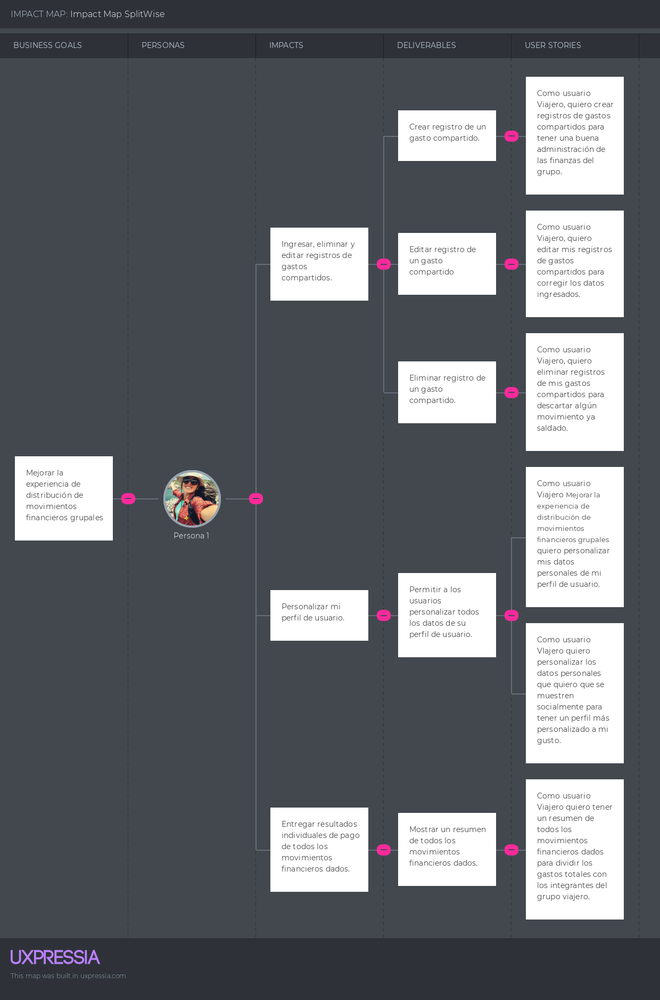

#### Digitalizar el 80% de procesos de registro de saldos y movimientos financieros grupales.

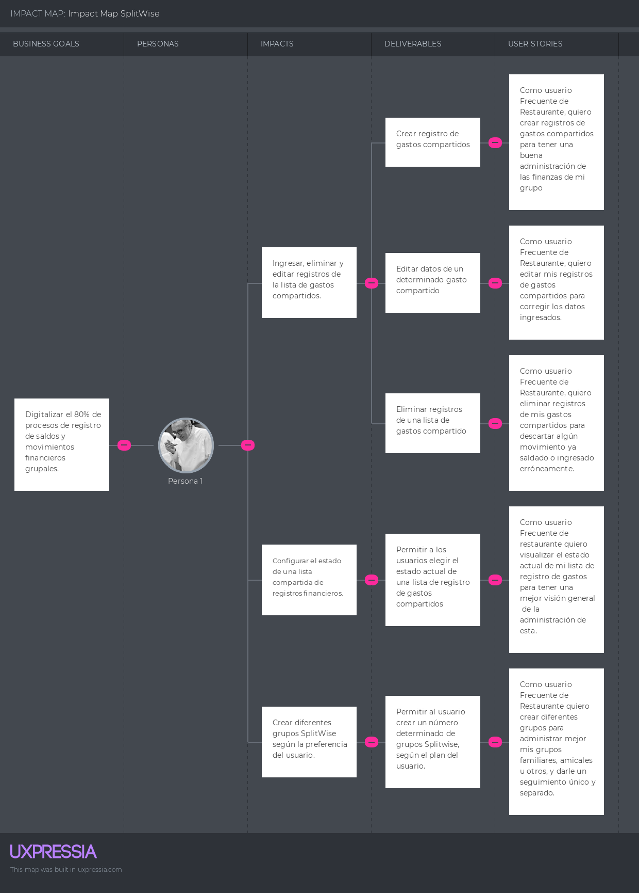

#### Discernir la preocupación constante del uso de diferentes registros de movimientos financieros en los usuarios Compañeros de piso.

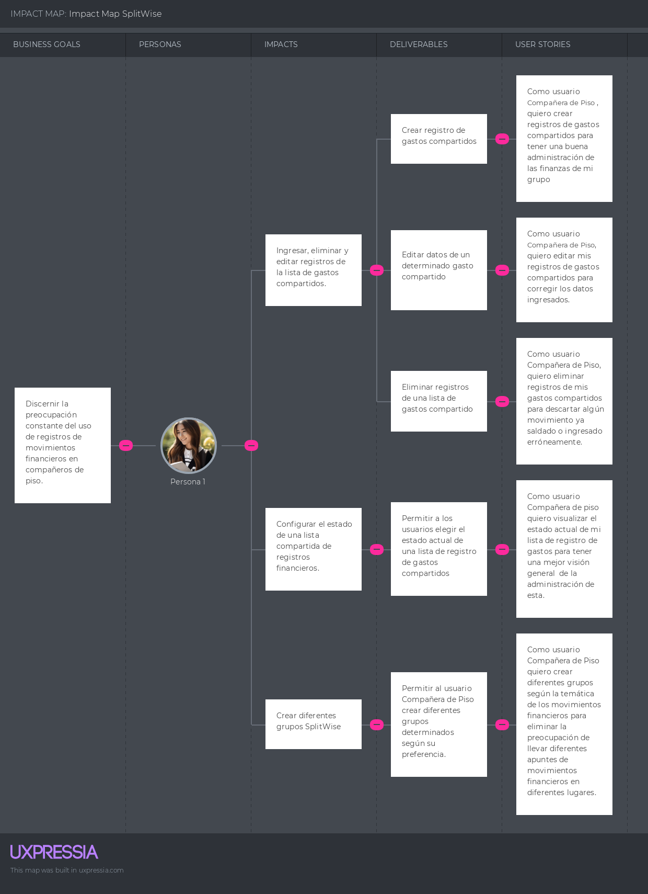

## 3.4 Product Backlog

<table>
  <thead>
    <tr>
      <th># Orden</th>
      <th>User Story ID</th>
      <th>Título</th>
      <th>Descripción</th>
      <th>Story Points</th>
    </tr>
  </thead>
  <tbody>
    <tr style="text-align: center;">
      <td>1</td>
      <td>US-01</td>
      <td>Landing Page - Home</td>
      <td style="text-align: justify;">Como usuario, deseo encontrar una página de inicio atractiva y bien diseñada al ingresar al sitio web de la empresa, para obtener una impresión positiva de la misma desde el primer momento.</td>
      <td>2</td>
    </tr>  
    <tr style="text-align: center;">
      <td>2</td>
      <td>US-02</td>
      <td>Seccion - Servicios</td>
      <td style="text-align: justify;">Como usuario, quiero observar una seccion en el Landing Page que me diga que servicios ofrece este aplicativo.</td>
      <td>2</td>
    </tr>
    <tr style="text-align: center;">
      <td>3</td>
      <td>US-03</td>
      <td>Video - AboutTheProduct</td>
      <td style="text-align: justify;">Como usuario, quiero observar una seccion en el Landing Page que tenga un video acerca del producto que estoy considerando usar.</td>
      <td>3</td>
    </tr>
    <tr style="text-align: center;">
      <td>4</td>
      <td>US-04</td>
      <td>Seccion Reseñas</td>
      <td style="text-align: justify;">Como usuario, quiero observar una seccion donde halla reseñas de aquellos usuarios que ya hicieron uso de la aplicacion.</td>
      <td>2</td>
    </tr>
    <tr style="text-align: center;">
      <td>5</td>
      <td>US-05</td>
      <td>Seccion Registro</td>
      <td style="text-align: justify;">Como usuario, quiero observar una seccion donde halla un apoyo visual y un formulario para registarse.</td>
      <td>2</td>
    </tr>
    <tr style="text-align: center;">
      <td>6</td>
      <td>US-06</td>
      <td>Seccion Contacto</td>
      <td style="text-align: justify;">Como usuario, quiero observar una seccion donde este los contactos, como numero fijo o redes sociales, de la empresa. </td>
      <td>2</td>
    </tr>
    <tr style="text-align: center;">
      <td>7</td>
      <td>US-07</td>
      <td>Nuevo Grupo</td>
      <td style="text-align: justify;">Como usuario, quiero crear un nuevo de dividion para podermantenerme al tanto de las actualizaciones en mis finanzas compartidas y evitar perder información importante.</td>
      <td>5</td>
    </tr>
    <tr style="text-align: center;">
      <td>8</td>
      <td>US-08</td>
      <td>Lista de los grupos</td>
      <td style="text-align: justify;">Como usuario, quiero poder buscar un grupo en específico por el nombre de los que soy miembro para tener una búsqueda ágil.</td>
      <td>3</td>
    </tr>
    <tr style="text-align: center;">
      <td>9</td>
      <td>US-09</td>
      <td>Detalles del Grupo</td>
      <td style="text-align: justify;">Como usuario, quiero poder observar los detalles de los grupo, cuanto me deben en total y por gasto para poder llevar una cuenta mas detalla de cada grupo y mis finanzas.</td>
      <td>5</td>
    </tr>
    <tr style="text-align: center;">
      <td>10</td>
      <td>US-10</td>
      <td>Añadir o Eliminar Transacciones</td>
      <td style="text-align: justify;">Como usuario, quiero poder editar o eliminar transacciones registradas incorrectamente para corregir errores y mantener un registro preciso de mis gastos compartidos.</td>
      <td>5</td>
    </tr>
    <tr style="text-align: center;">
      <td>11</td>
      <td>US-11</td>
      <td>Reportes de Gastos</td>
      <td style="text-align: justify;">Como usuario, quiero poder ver informes detallados sobre mis gastos compartidos para comprender mejor mis patrones de gastos y tomar decisiones financieras más informadas.</td>
      <td>2</td>
    </tr>
    <tr style="text-align: center;">
      <td>12</td>
      <td>US-12</td>
      <td>Conversor de Moneda Integrado</td>
      <td style="text-align: justify;">Como usuario, quiero convertir los montos de mis transacciones a diferentes monedas para facilitar la comprensión de los gastos por parte de los usuarios que usen otras monedas.</td>
      <td>5</td>
    </tr>
    <tr style="text-align: center;">
      <td>13</td>
      <td>US-13</td>
      <td>Detalles de Transacción</td>
      <td style="text-align: justify;">Como usuario, quiero visualizar detalles específicos de cada transacción, como el nombre del usuario que ingresó la transacción, la fecha y una descripción del gasto, para tener claridad y transparencia en el registro de gastos compartidos.</td>
      <td>5</td>
    </tr>
    <tr style="text-align: center;">
      <td>14</td>
      <td>US-14</td>
      <td>Registro de Pago</td>
      <td style="text-align: justify;"> Como usuario, quiero registrar los pagos que hago a otros miembros del grupo para mantener un registro preciso y actualizado de las deudas pagadas y pendientes.</td>
      <td>5</td>
    </tr>
    <tr style="text-align: center;">
      <td>15</td>
      <td>US-15</td>
      <td>Historial de Gastos</td>
      <td style="text-align: justify;">Como usuario, quiero visualizar el historial de gastos compartidos para revisar y analizar mis finanzas pasadas y tener un registro claro de todas las transacciones realizadas.</td>
      <td>5</td>
    </tr>
    <tr style="text-align: center;">
      <td>16</td>
      <td>US-16</td>
      <td>Dividir Gastos</td>
      <td style="text-align: justify;">Como usuario, quiero tener la opción de dividir un gasto en partes iguales entre los miembros del grupo para reflejar situaciones donde los costos no se distribuyen equitativamente.</td>
      <td>3</td>
    </tr>
    <tr style="text-align: center;">
      <td>17</td>
      <td>US-17</td>
      <td>Grafico de gastos mensuales </td>
      <td style="text-align: justify;">Como usuario, quiero poder obervar en la aplicación PocketPartners mis finanzas desde un gráfico en la seccion "Home".</td>
      <td>3</td>
    </tr>
    <tr style="text-align: center;">
      <td>18</td>
      <td>US-18</td>
      <td>Nuevo Gasto por Grupo</td>
      <td style="text-align: justify;">Como usuario, quiero poder agregar un nuevo gasto realizado y por especificiar el grupo.</td>
      <td>5</td>
    </tr>
    <tr style="text-align: center;">
      <td>19</td>
      <td>US-19</td>
      <td>Descartar Contactos</td>
      <td style="text-align: justify;">Como usuario, quiero poder descartar contactos de una dividion de gasto para poder gestionar mis finanzas compartidas de manera mas sencilla.</td>
      <td>2</td>
    </tr>
    <tr style="text-align: center;">
      <td>20</td>
      <td>US-20</td>
      <td>Grafico de avanze de pagos</td>
      <td style="text-align: justify;">Como usuario, quiero poder observar un grafico de pie para poder analizar cuantos pagos restantes faltan</td>
      <td>3</td>
    </tr>
    <tr style="text-align: center;">
      <td>21</td>
      <td>US-21</td>
      <td>Nuevo Contacto</td>
      <td style="text-align: justify;">Como usuario quiero poder añadir un nuevo contacto para poder seleccionarlos cuando llegue a crear un nuevo Grupo.</td>
      <td>2</td>
    </tr>
    <tr style="text-align: center;">
      <td>22</td>
      <td>US-22</td>
      <td>Acceso a Contactos</td>
      <td style="text-align: justify;">Como usuario quiero poder tener acceso a una lista de los contactos que tengo en esta aplicación.</td>
      <td>5</td>
    </tr>
    <tr style="text-align: center;">
      <td>23</td>
      <td>US-23</td>
      <td>Inicio de sesión en la aplicación</td>
      <td style="text-align: justify;">Como usuario, quiero ser capaz de iniciar sesión en la aplicación para poder ver los servicios que ofrece PocketPartners.</td>
      <td>5</td>
    </tr>
    <tr style="text-align: center;">
      <td>24</td>
      <td>US-24</td>
      <td>Cierre de sesión en la aplicación</td>
      <td style="text-align: justify;">Como usuario, deseo tener la capacidad de finalizar la sesión en mi cuenta después de utilizar la aplicación, con el fin de garantizar que algun externo pueda acceder a mis datos de la aplicación ni a la información personal que he proporcionado en ella.</td>
      <td>5</td>
    </tr>
    <tr style="text-align: center;">
      <td>25</td>
      <td>US-26</td>
      <td>Modelado de las clases y endpoints</td>
      <td style="text-align: justify;">Como desarrollador, quiero que las clases dentro del backend estén bien estructuradas, para poder alcanzar los endpoint necesarios.</td>
      <td>5</td>
    </tr>
    <tr style="text-align: center;">
      <td>26</td>
      <td>US-26</td>
      <td>Integracion del backend con el frontend</td>
      <td style="text-align: justify;">Como desarrollador, busco establecer una comunicación eficiente entre el backend y el frontend de PocketPartners para permitir una interacción completa y sin problemas en la aplicación.</td>
      <td>5</td>
    </tr>
  </tbody>  
</table>